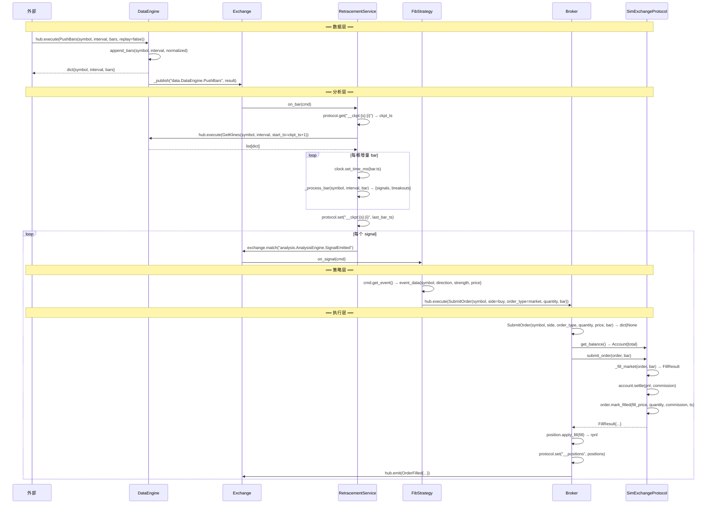
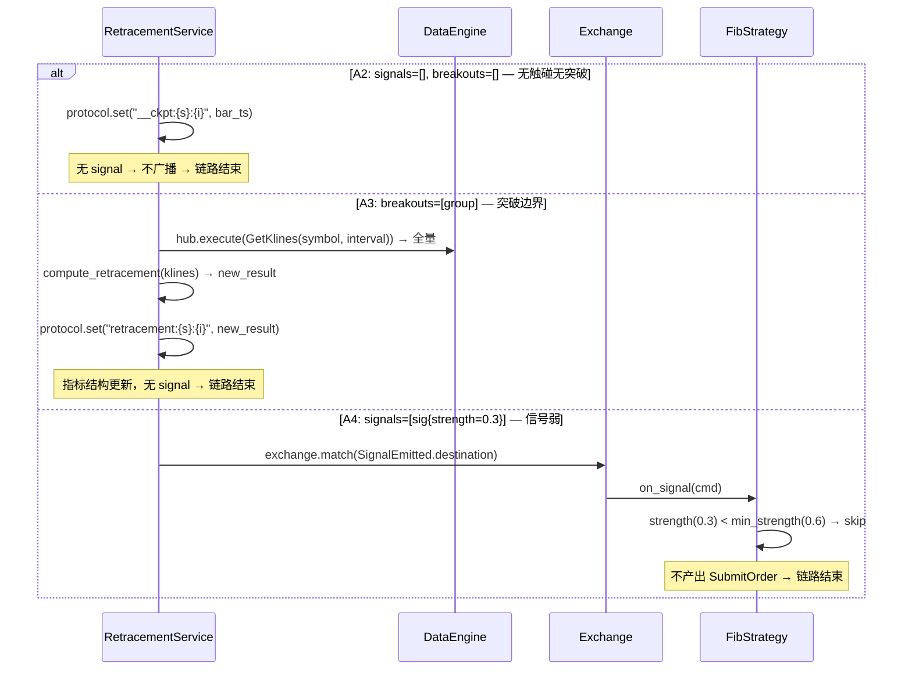
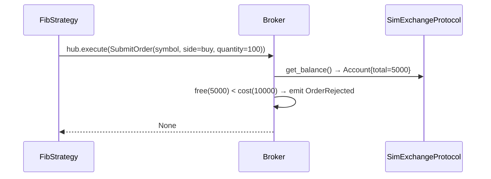
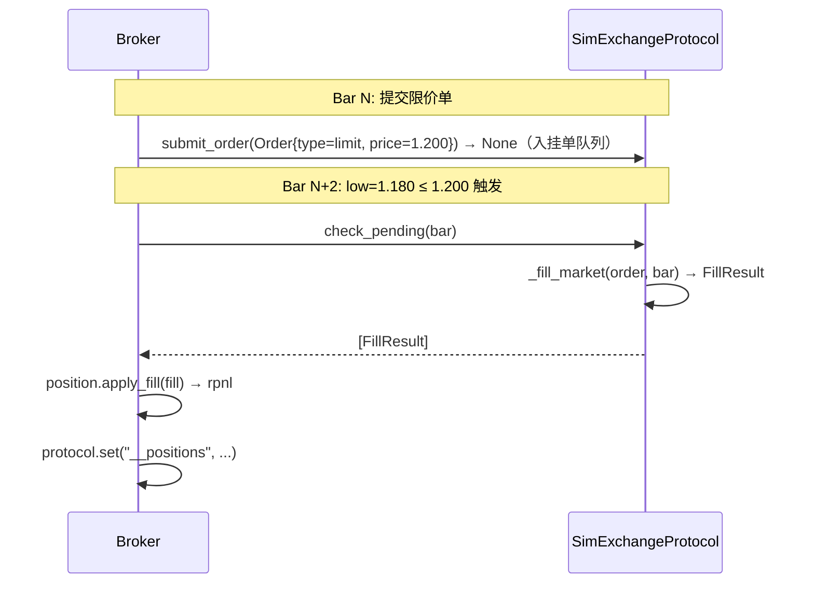
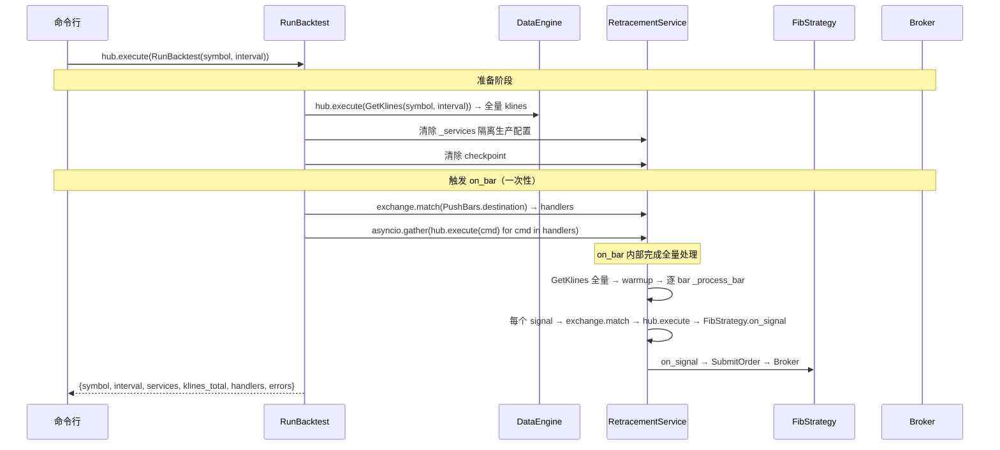
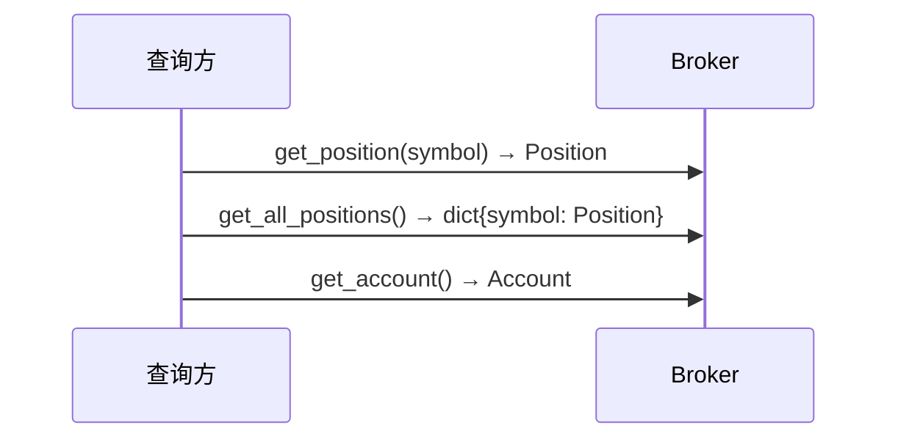
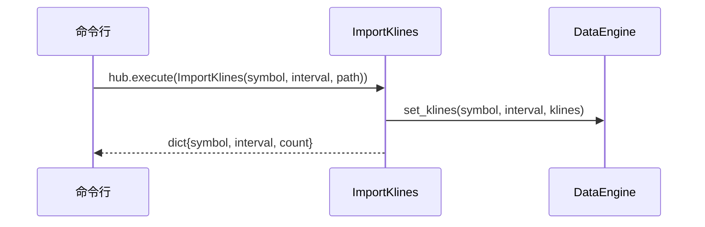

# Phase 4：端到端顺序图

从 00-scenarios.md 场景故事出发，每条箭头是一次精确的方法调用：`Class.method(params) → ReturnType`。

## 场景覆盖矩阵

| 顺序图 | 覆盖场景 | 核心路径 |
|--------|---------|---------|
| 图 1 | A1 | 推 bar → 触碰信号 → 市价成交（主干） |
| 图 2 | A2, A3, A4 | 分析层三条分支（无信号 / 突破重算 / 信号弱跳过） |
| 图 3 | A5, A7 | 执行层两条分支（余额拒绝 / 限价挂单触发） |
| 图 4 | B1 | 回测完整流程 |
| 图 5 | A6, A9, B2, B3 | 查询中间记录 / 查询持仓账户 / 回测结果读取 |
| 图 6 | A10 | 数据文件导入 |

---

## 图 1：A1 主流程 — 推 bar → 触碰信号 → 市价成交

### 图 1 方法调用清单

| # | 调用方 | 被调用方 | 方法签名 |
|---|--------|---------|---------|
| 1 | 外部 | DataEngine | `PushBars(symbol: str, interval: str, bars: list, replay: bool) → dict` |
| 2 | PushBars | DataEngine | `append_bars(symbol, interval, bars) → None` |
| 3 | 框架 | Exchange | `_publish(topic, result)` |
| 4 | Exchange | RetracementService | `on_bar(cmd) → dict｜None` |
| 5 | RetracementService | protocol | `get("__ckpt:{s}:{i}") → int｜None` |
| 6 | RetracementService | DataEngine | `hub.execute(GetKlines(symbol, interval, start_ts)) → list[dict]` |
| 7 | RetracementService | self | `_process_bar(symbol, interval, bar) → dict{signals, breakouts}` |
| 8 | RetracementService | protocol | `set("__ckpt:{s}:{i}", ts) → None` |
| 9 | Exchange | FibStrategy | `on_signal(cmd) → None` |
| 10 | FibStrategy | Broker | `hub.execute(SubmitOrder(...)) → dict｜None` |
| 11 | Broker | SimExchange | `get_balance() → Account` |
| 12 | Broker | SimExchange | `submit_order(Order, bar) → FillResult｜None` |
| 13 | SimExchange | self | `_fill_market(Order, bar) → FillResult` |
| 14 | SimExchange | Account | `settle(pnl, commission) → None` |
| 15 | Broker | Position | `apply_fill(FillResult) → float(rpnl)` |
| 16 | Broker | protocol | `set("__positions", dict) → None` |
| 17 | Broker | Exchange | `hub.emit(OrderFilled) → None` |

---

## 图 2：A2/A3/A4 分析层三条分支

---

## 图 3：A5 余额拒绝 + A7 限价挂单触发

### 3a: A5 — 余额不足

### 3b: A7 — 限价挂单 → 后续 bar 触发

---

## 图 4：B1 回测主流程

---

## 图 5：A6/A9/B2/B3 查询场景

---

## 图 6：A10 数据文件导入

---

## 方法签名汇总

### Command 签名

| 命令 | 签名 | 出现图 |
|------|------|--------|
| PushBars | `PushBars(symbol: str, interval: str, bars: list, replay: bool) → dict` | 1, 4 |
| GetKlines | `GetKlines(symbol: str, interval: str, start_ts: int, end_ts: int) → list` | 1, 2, 4 |
| SubmitOrder | `SubmitOrder(symbol: str, side: str, order_type: str, quantity: float, price: float, stop_price: float, bar: dict) → dict｜None` | 1, 3, 4 |
| RunBacktest | `RunBacktest(symbol: str, interval: str) → dict` | 4 |
| ImportKlines | `ImportKlines(symbol: str, interval: str, path: str) → dict` | 6 |

### 服务方法

| 服务 | 方法 | 签名 |
|------|------|------|
| DataEngine | append_bars | `(symbol, interval, bars) → None` |
| DataEngine | get_klines | `(symbol, interval, start_ts=None) → list[dict]` |
| DataEngine | set_klines | `(symbol, interval, klines) → None` |
| AnalysisEngine | on_bar | `(cmd) → dict｜None` |
| AnalysisEngine | _warmup | `(symbol, interval, klines) → None` |
| AnalysisEngine | _process_bar | `(symbol, interval, bar) → dict{signals, breakouts}` |
| FibStrategy | on_signal | `(cmd) → None` |
| Broker | on_submit_order | `(order, bar=None) → FillResult｜None` |
| Broker | get_position | `(symbol) → Position` |
| Broker | get_all_positions | `() → dict{symbol: Position}` |
| Broker | get_account | `() → Account` |
| SimExchange | submit_order | `(order, bar=None) → FillResult｜None` |
| SimExchange | _fill_market | `(order, bar) → FillResult` |
| SimExchange | check_pending | `(bar) → list[FillResult]` |
| SimExchange | get_balance | `() → Account` |

---

## 差异设计描述

以设计文档为准，后续代码迭代时统一处理：

- [x] analysis/app.py：on_bar 末尾增加 `protocol.set("signals:{s}:{i}", signals)` 持久化信号
- [x] strategy/app.py：on_signal 中增加 `protocol.set("decisions:{s}", Decision)` 持久化决策
- [x] execution/broker.py：_process_fill 中增加 `protocol.set("__fills", fills)` 持久化成交
- [x] execution/broker.py：`_sync_emit`（同步广播）已在代码中实现
- [ ] engine/command.py：图 4 以代码现状为准——一次触发批量方式（清除 _services + checkpoint → 构造 PushBars 触发一次 on_bar → on_bar 内部全量处理）。**图 4 顺序图已按代码现状更新。**
- [x] engine/command.py：RunBacktest 返回值改为 `{signals, decisions, fills, account, positions, ...}`
- [x] execution/broker.py：增加 `process_pending(bar)` 方法，委托 SimExchange.check_pending
- [x] execution/broker.py：SubmitOrder 中增加 `_persist_order(order)` 持久化订单
- [x] execution/broker.py：mark_filled 后更新 `_persist_order(order)` 状态
