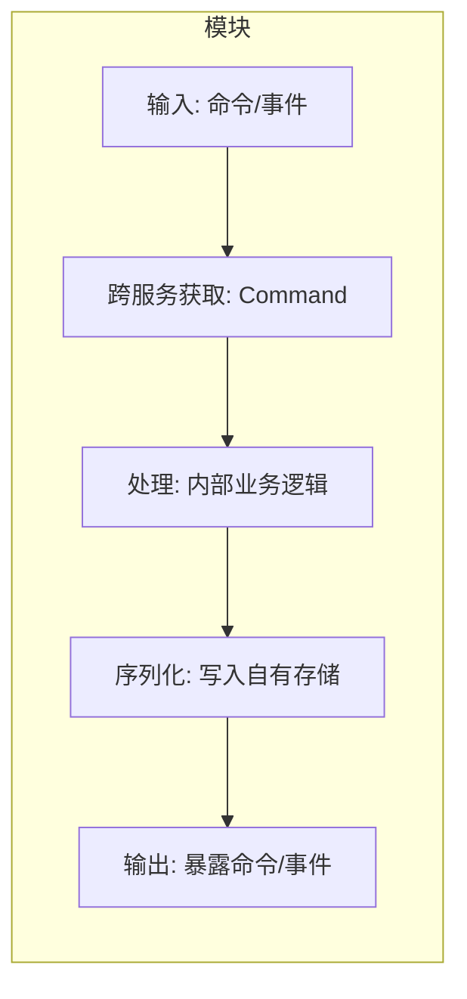
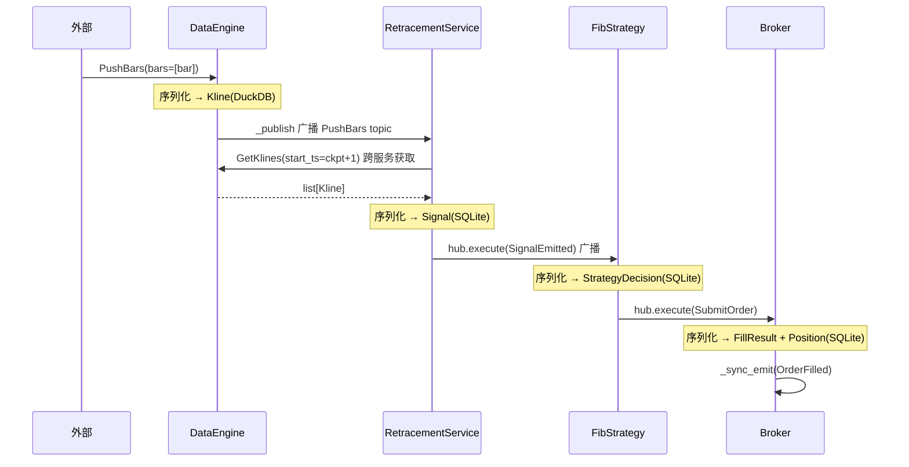
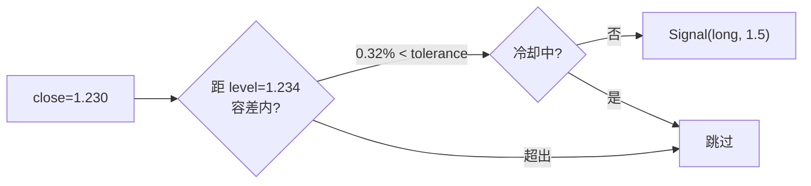
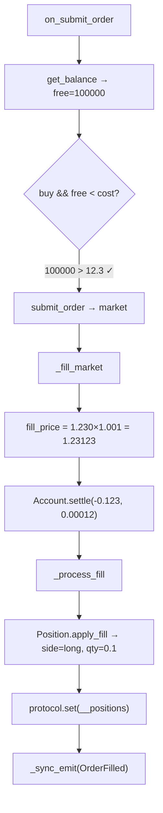
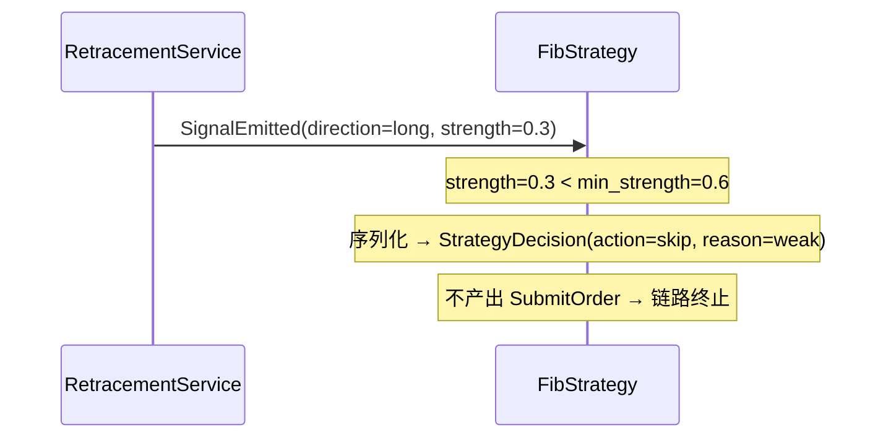
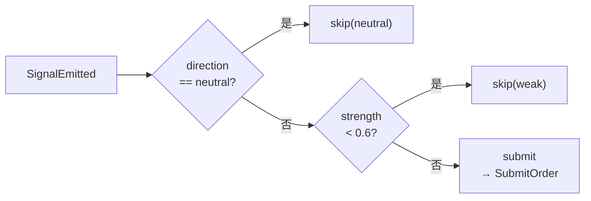
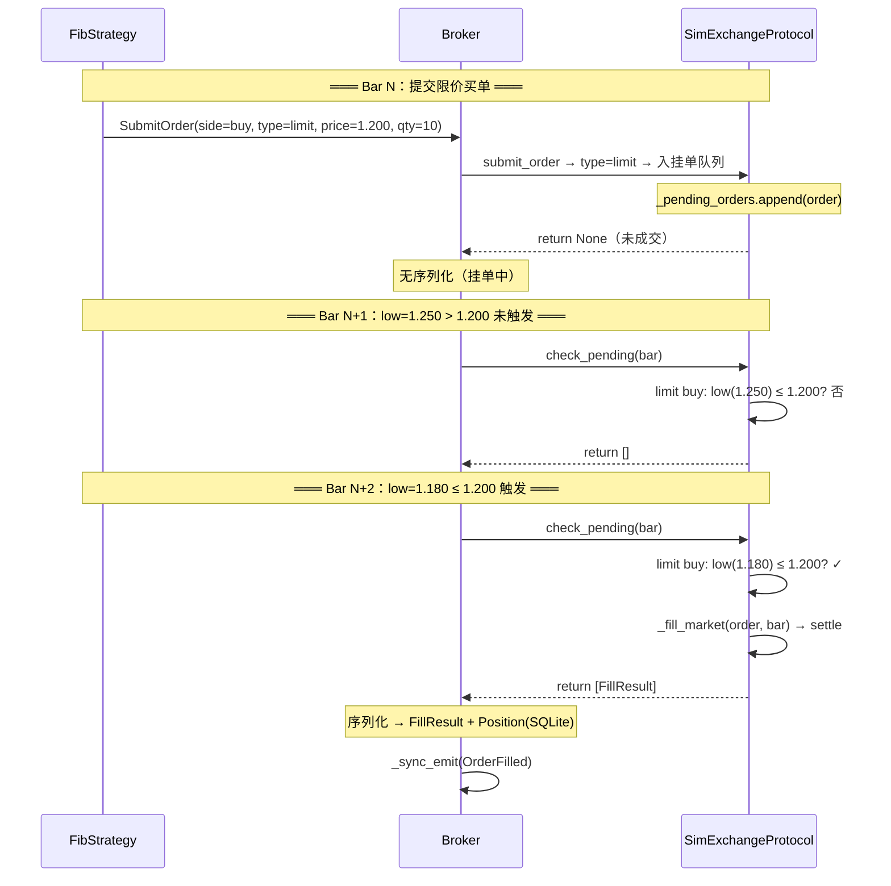
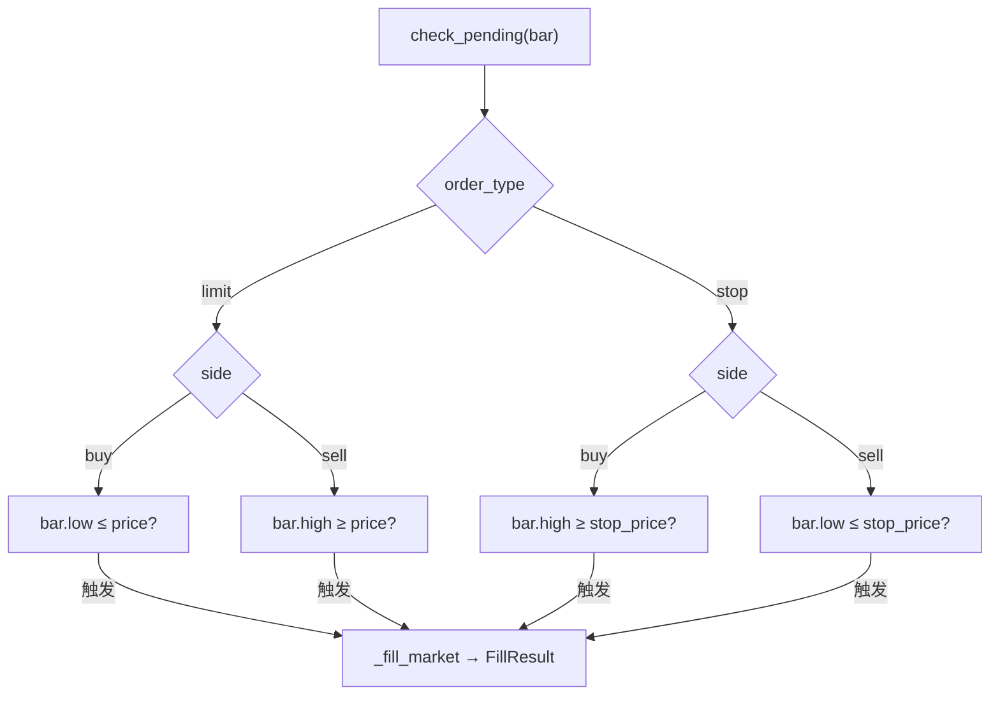
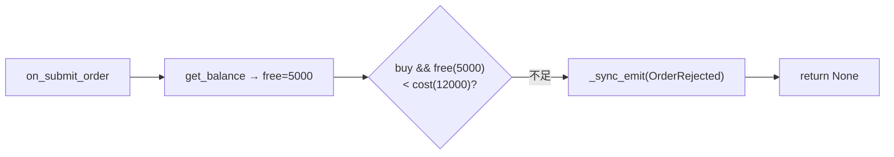

# 附录：端到端追踪示例

## 模块 I/O 约定

每个模块遵循统一的边界模式：



**核心规则**：模块间数据流转**仅通过命令/事件**，不直接读写其他模块的存储。

### 各模块序列化输出一览

| 模块 | 存储 | 序列化 key | 模型 | 对外暴露 |
|------|------|-----------|------|---------|
| DataEngine | DuckDB | `{symbol}:{interval}` | Kline | `GetKlines` 命令 |
| RetracementService | SQLite | `retracement:{s}:{i}` | 回撤结构 | 内部缓存 |
| RetracementService | SQLite | `__ckpt:{s}:{i}` | int(ts) | 内部进度 |
| RetracementService | SQLite | `signals:{s}:{i}` | Signal | `SignalEmitted` 事件广播 |
| FibStrategy | SQLite | `decisions:{s}:{i}` | StrategyDecision | `SubmitOrder` 命令 |
| Broker | SQLite | `__positions` | Position | `get_position()` / `get_account()` |
| Broker | SQLite | `__fills` | FillResult | `OrderFilled` 事件广播 |

---

## 示例一：新 Bar → 触碰信号 → 市价买入成交

覆盖全四层正常主流程：每个模块接收上游输出，处理后序列化自有结果，再暴露给下游。

### 全局时序



### DataEngine 模块

| | |
|---|---|
| **输入** | `PushBars(symbol="159363.OF", interval="1d", bars=[{open,high,low,close,volume,ts}])` |
| **处理** | normalize → `append_bars` 追加 |
| **序列化** | DuckDB `klines` 表 → `Kline{symbol, interval, ts, open, high, low, close, volume}` |
| **输出** | `_publish` 广播 PushBars topic → subscriber 触发 |

```python
# PushBars.__call__
if not self.replay: await app.append_bars(self.symbol, self.interval, normalized)
return {"symbol": self.symbol, "interval": self.interval, "bars": normalized}
# 框架 _publish → Exchange 按 topic 路由到 RetracementService.on_bar
```

### RetracementService 模块

| | |
|---|---|
| **输入** | `on_bar(cmd)` — subscriber 订阅 `data.DataEngine.PushBars` |
| **跨服务获取** | `hub.execute(GetKlines(symbol, interval, start_ts=ckpt+1))` → 从 DataEngine 拉增量 K 线 |
| **处理** | `_process_bar`: 触碰检测 — close(1.230) 距 Fib 0.618 关键位(1.234) 在容差内 → 产出信号 |
| **序列化** | SQLite `signals:{s}:{i}` → `Signal{ts, symbol, interval, direction, strength, source, price, level}` |
| **输出** | `hub.execute(SignalEmitted)` 同步广播 → subscriber 触发 |

```python
# AnalysisEngine.on_bar 关键流程
checkpoint_ts = await self.protocol.get(f"__ckpt:{symbol}:{interval}") or 0
if checkpoint_ts == 0:  # 冷启动：全量拉取 → _warmup → 剩余 bars
    ...
else:                    # 增量（本例）
    new_bars = GetKlines(symbol, interval, start_ts=checkpoint_ts + 1)
for bar in new_bars:
    bar_result = await self._process_bar(symbol, interval, bar)
    output["signals"].extend(bar_result.get("signals", []))
await self.protocol.set(f"__ckpt:{symbol}:{interval}", int(new_bars[-1]["ts"]))
# 逐个信号广播
for sig in output["signals"]:
    event = SignalEmitted(direction="long", strength=1.5, price=1.230, level=1.234, ...)
    for handler_cls in hub.exchange.match(type(event).destination):
        cmd = handler_cls(); cmd.add_event(event); await hub.execute(cmd)
```

**触碰检测逻辑**：



### FibStrategy 模块

| | |
|---|---|
| **输入** | `on_signal(cmd)` — subscriber 订阅 `analysis.AnalysisEngine.SignalEmitted` |
| **跨服务获取** | 无（信号通过事件推送） |
| **处理** | 过滤 — `direction=long` ≠ neutral ✓，`strength=1.5` ≥ 0.6 ✓ → submit |
| **序列化** | SQLite `decisions:{s}:{i}` → `StrategyDecision{ts, signal_ts, action="submit", order_id, quantity}` |
| **输出** | `hub.execute(SubmitOrder(side=buy, type=market, quantity=0.1))` |

```python
# FibStrategy.on_signal
if direction == "neutral": return  # skip
if strength < self.min_strength: return  # skip
side = "buy" if direction == "long" else "sell"
bar = {"close": price, "ts": event_data.get("ts", 0)}
await hub.execute(SubmitOrder(symbol=symbol, side=side, quantity=0.1, bar=bar))
```

### Broker 模块

| | |
|---|---|
| **输入** | `on_submit_order(order, bar)` — SubmitOrder destination 路由 |
| **跨服务获取** | 无 |
| **处理** | ① 余额检查 → ② SimExchange._fill_market → ③ Account.settle → ④ Position.apply_fill |
| **序列化** | SQLite `__fills` → `FillResult{order_id, symbol, side, filled_price, filled_quantity, commission, ts}` |
| | SQLite `__positions` → `Position{symbol, side, quantity, avg_entry_price, realized_pnl}` |
| **输出** | `_sync_emit(OrderFilled)` 同步广播 |



### 数据流转总览

```
DataEngine        RetracementService      FibStrategy        Broker
┌──────────┐      ┌──────────────────┐    ┌────────────┐    ┌──────────────────┐
│ 序列化:   │      │ 序列化:          │    │ 序列化:     │    │ 序列化:           │
│  Kline    │─bar─▶│  Signal          │─sig▶│ Decision   │─ord▶│ FillResult       │
│ (DuckDB)  │      │  checkpoint      │    │ (SQLite)   │    │ Position         │
│           │      │ (SQLite)         │    │            │    │ (SQLite)         │
└──────────┘      └──────────────────┘    └────────────┘    └──────────────────┘
   暴露:              暴露:                  暴露:             暴露:
  GetKlines        SignalEmitted          SubmitOrder       OrderFilled
                                                           get_position()
                                                           get_account()
```

---

## 示例二：信号强度不足 → 策略跳过

覆盖策略层的 skip 分支。DataEngine 和 RetracementService 的处理与示例一相同，区别从 FibStrategy 开始。

### 全局时序



### FibStrategy 模块（skip 路径）

| | |
|---|---|
| **输入** | `SignalEmitted(direction=long, strength=0.3, price=1.230)` |
| **处理** | `strength(0.3) < min_strength(0.6)` → 不通过 |
| **序列化** | SQLite `decisions:{s}:{i}` → `StrategyDecision{ts, signal_ts, action="skip", reason="weak"}` |
| **输出** | 无 — 链路终止，不产出 SubmitOrder |

**两道过滤关卡**：



| 信号 | direction | strength | 结果 | reason |
|------|-----------|----------|------|--------|
| 信号 A | neutral | 2.0 | skip | neutral |
| 信号 B | long | 0.3 | skip | weak |
| 信号 C | long | 1.5 | submit | — |
| 信号 D | short | 0.8 | submit | — |

---

## 示例三：限价买单 → 挂起 → 后续 Bar 触发成交

覆盖执行层的挂单队列和 `check_pending` 触发逻辑。前三层（DataEngine → RetracementService → FibStrategy）流程同示例一，FibStrategy 产出 `SubmitOrder(type=limit, price=1.200)`。

### 全局时序



### Broker 模块（限价单路径）

#### 提交阶段（Bar N）

| | |
|---|---|
| **输入** | `SubmitOrder(side=buy, type=limit, price=1.200, quantity=10)` |
| **处理** | `submit_order` → `order_type != "market"` → 入挂单队列 |
| **序列化** | 无（挂单保存在 `SimExchangeProtocol._pending_orders` 内存列表） |
| **输出** | return None — 无成交事件 |

#### 触发阶段（Bar N+2）

| | |
|---|---|
| **输入** | `process_pending(bar)` — 回测逐 bar 循环调用 |
| **处理** | `check_pending` → limit buy 条件 `bar.low(1.180) ≤ price(1.200)` ✓ → `_fill_market` |
| **序列化** | SQLite `__fills` → `FillResult{filled_price=1.191, commission=0.0119, ts=...}` |
| | SQLite `__positions` → `Position{side=long, quantity=10, avg_entry_price=1.191}` |
| **输出** | `_sync_emit(OrderFilled)` |

**check_pending 触发条件**：



#### 余额拒绝变体

若 Broker 余额检查不通过，链路在提交阶段终止：



Broker 不做序列化，广播 `OrderRejected(order_id, symbol, reason="余额不足")`。

---

## 生产 vs 回测模式对比

两种模式复用同一套模块 I/O 链路，差异仅在事件传递和数据源：

| 维度 | 生产 | 回测 |
|------|------|------|
| PushBars.bars | 实际 bar 数据 | [] 空（触发载体） |
| replay | false → 写入 DuckDB | true → 跳过写入 |
| 事件分发 | _publish → create_task（异步） | exchange.match → hub.execute（同步） |
| 数据获取 | on_bar 内 GetKlines 增量拉取 | on_bar 内 GetKlines 全量拉取（checkpoint 已清除） |
| 存储路径 | `cache/` | `cache/backtest_{sym}_{intv}_{ts}/` |
