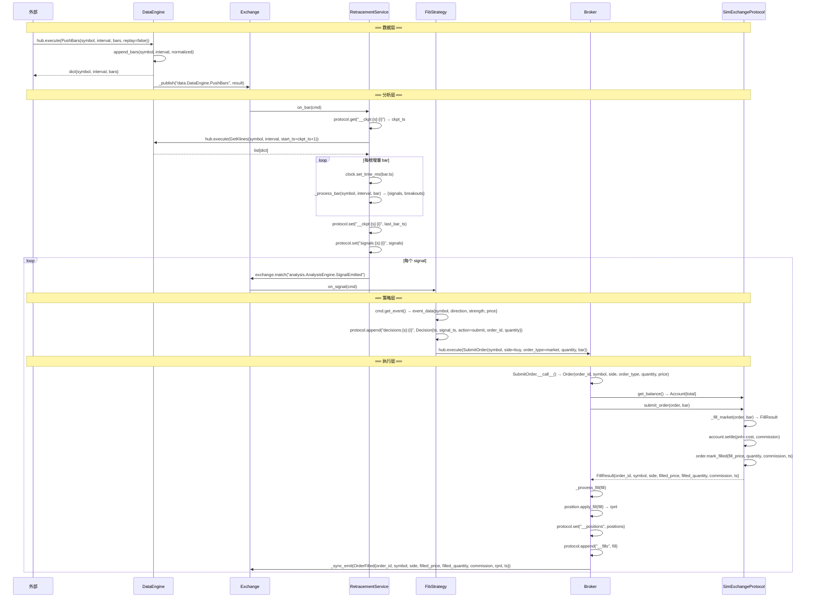
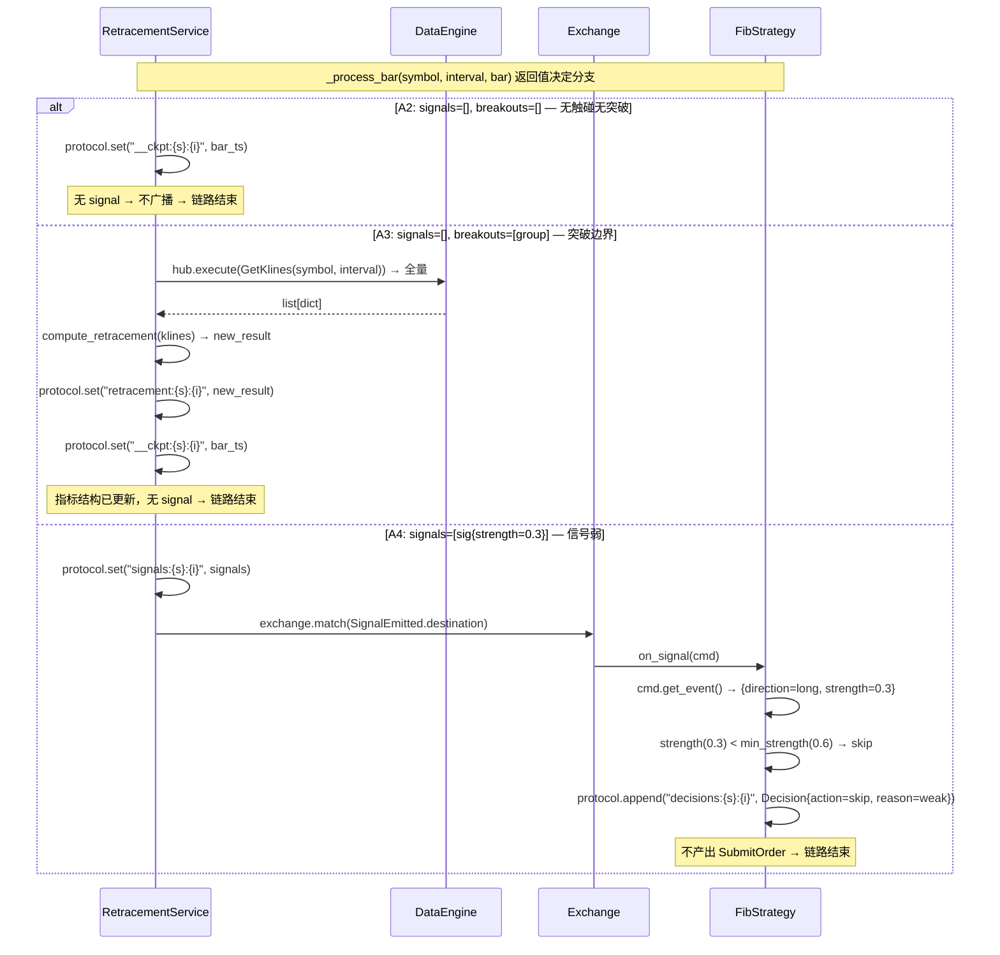
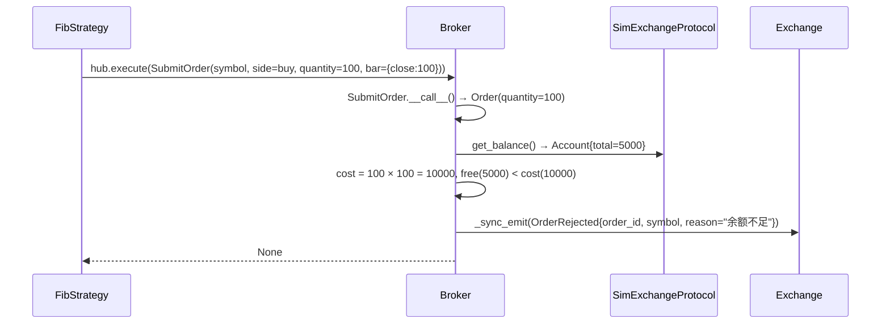
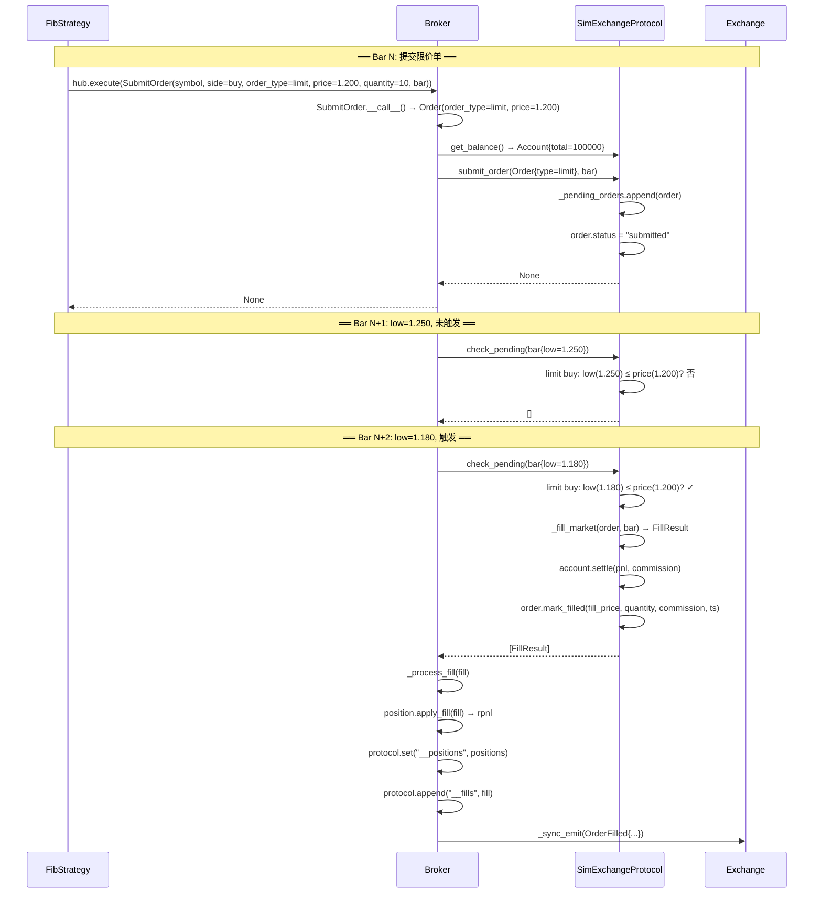
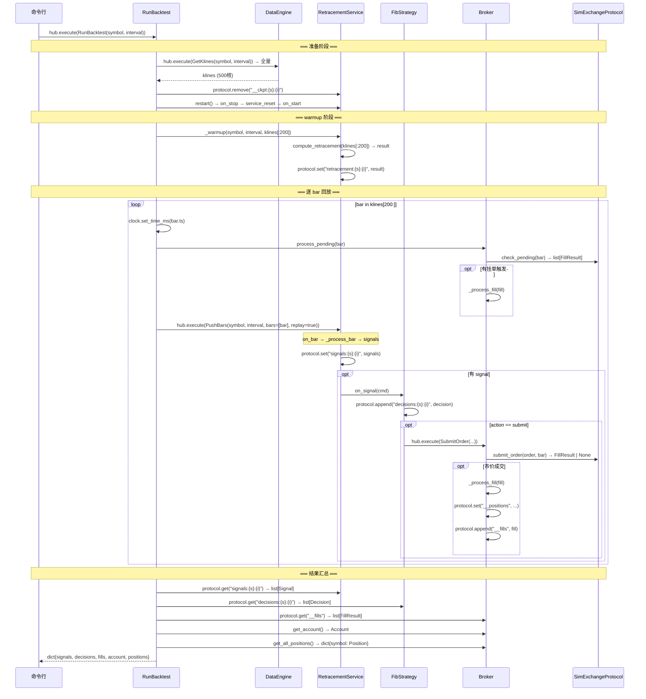
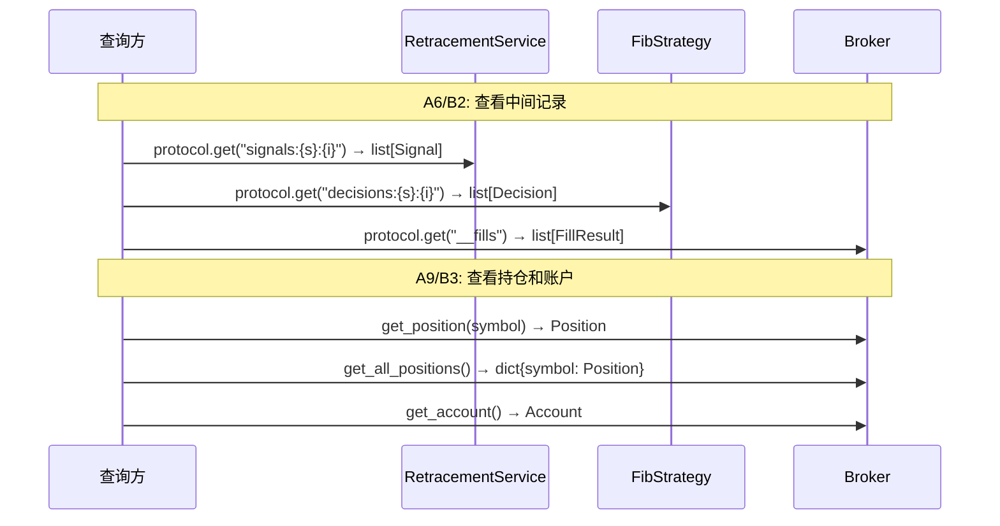
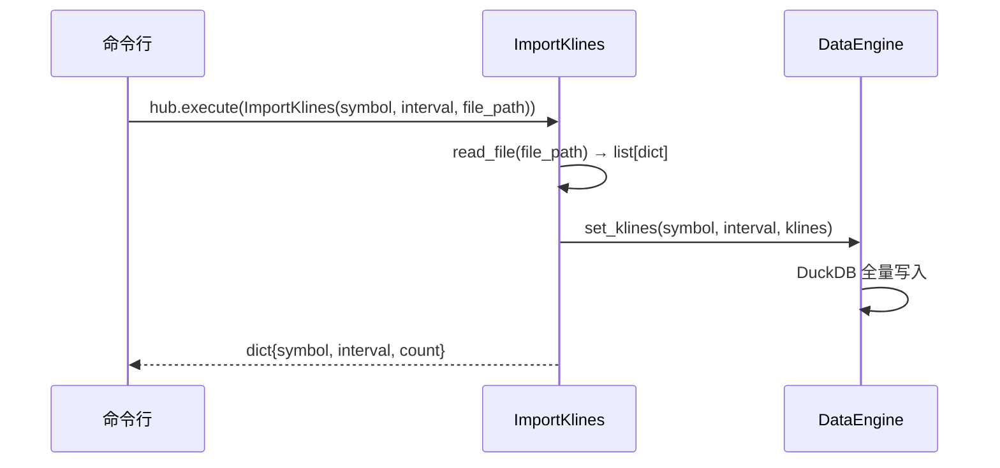

# 附录 A1：精确顺序图

从 A0 场景故事出发，每条箭头是一次精确的方法调用：`Class.method(params) → ReturnType`。

## 场景覆盖矩阵

| 顺序图 | 覆盖场景 | 核心路径 |
|--------|---------|---------|
| 图 1 | A1 | 推 bar → 触碰信号 → 市价成交（主干） |
| 图 2 | A2, A3, A4 | 分析层三条分支（无信号 / 突破重算 / 信号弱跳过） |
| 图 3 | A5, A7 | 执行层两条分支（余额拒绝 / 限价挂单触发） |
| 图 4 | B1 | 回测完整流程 |
| 图 5 | A6, A9, B2, B3 | 查询中间记录 / 查询持仓账户 / 回测结果读取 |
| 图 6 | A10 | 数据文件导入到 DataEngine 数据库 |

---

## 图 1：A1 主流程 — 推 bar → 触碰信号 → 市价成交

覆盖全部四层，所有内部调用均展开为精确箭头。

### 图 1 方法调用清单

| # | 调用方 | 被调用方 | 方法签名 |
|---|--------|---------|---------|
| 1 | 外部 | DataEngine | `PushBars.__call__() → dict{symbol, interval, bars}` |
| 2 | PushBars | DataEngine | `append_bars(symbol, interval, bars) → None` |
| 3 | 框架 | Exchange | `_publish(topic, result)` |
| 4 | Exchange | RetracementService | `on_bar(cmd) → dict｜None` |
| 5 | RetracementService | protocol | `get("__ckpt:{s}:{i}") → int｜None` |
| 6 | RetracementService | DataEngine | `hub.execute(GetKlines(symbol, interval, start_ts)) → list[dict]` |
| 7 | RetracementService | self | `_process_bar(symbol, interval, bar) → dict{signals, breakouts}` |
| 8 | RetracementService | protocol | `set("__ckpt:{s}:{i}", ts) → None` |
| 9 | RetracementService | protocol | `set("signals:{s}:{i}", list[Signal]) → None` |
| 10 | Exchange | FibStrategy | `on_signal(cmd) → None` |
| 11 | FibStrategy | protocol | `append("decisions:{s}:{i}", StrategyDecision) → None` |
| 12 | FibStrategy | Broker | `hub.execute(SubmitOrder(symbol, side, order_type, quantity, bar)) → FillResult｜None` |
| 13 | SubmitOrder | Broker | `on_submit_order(Order, bar) → FillResult｜None` |
| 14 | Broker | SimExchange | `get_balance() → Account` |
| 15 | Broker | SimExchange | `submit_order(Order, bar) → FillResult｜None` |
| 16 | SimExchange | self | `_fill_market(Order, bar) → FillResult` |
| 17 | SimExchange | Account | `settle(pnl, commission) → None` |
| 18 | SimExchange | Order | `mark_filled(price, qty, comm, ts) → None` |
| 19 | Broker | self | `_process_fill(FillResult) → FillResult` |
| 20 | Broker | Position | `apply_fill(FillResult) → float(rpnl)` |
| 21 | Broker | protocol | `set("__positions", dict) → None` |
| 22 | Broker | protocol | `append("__fills", FillResult) → None` |
| 23 | Broker | Exchange | `_sync_emit(OrderFilled) → None` |

---

## 图 2：A2/A3/A4 分析层三条分支

三条分支都从 `_process_bar` 的返回值开始分岔，前置流程（推 bar → on_bar → GetKlines → 循环）与图 1 相同。

### 图 2 新增方法（图 1 未出现的）

| # | 调用方 | 被调用方 | 方法签名 | 场景 |
|---|--------|---------|---------|------|
| 24 | RetracementService | algo | `compute_retracement(klines) → RetraceResult` | A3 |
| 25 | RetracementService | protocol | `set("retracement:{s}:{i}", RetraceResult) → None` | A3 |

---

## 图 3：A5 余额拒绝 + A7 限价挂单触发

### 3a: A5 — 余额不足拒绝

从 Broker.on_submit_order 开始分岔（前置流程同图 1 直到策略产出 SubmitOrder）。

### 3b: A7 — 限价挂单 → 后续 bar 触发

### 图 3 新增方法

| # | 调用方 | 被调用方 | 方法签名 | 场景 |
|---|--------|---------|---------|------|
| 26 | Broker | Exchange | `_sync_emit(OrderRejected{order_id, symbol, reason}) → None` | A5 |
| 27 | Broker | SimExchange | `check_pending(bar) → list[FillResult]` | A7 |
| 28 | Broker | self | `process_pending(bar) → list[FillResult]` | A7 |

---

## 图 4：B1 回测主流程

### 图 4 新增方法

| # | 调用方 | 被调用方 | 方法签名 | 备注 |
|---|--------|---------|---------|------|
| 29 | RunBacktest | DataEngine | `hub.execute(GetKlines(symbol, interval)) → list[dict]` | 全量拉取 |
| 30 | RunBacktest | RetracementService | `protocol.remove("__ckpt:{s}:{i}") → None` | 清除进度 |
| 31 | RunBacktest | RetracementService | `restart() → None` | mode 生命周期重置 |
| 32 | RunBacktest | RetracementService | `_warmup(symbol, interval, klines) → None` | 初始化指标 |
| 33 | RunBacktest | Broker | `process_pending(bar) → list[FillResult]` | 逐 bar 挂单检查 |
| 34 | RunBacktest | Broker | `get_account() → Account` | 汇总 |
| 35 | RunBacktest | Broker | `get_all_positions() → dict{symbol: Position}` | 汇总 |
| 36 | RunBacktest | 各模块 protocol | `get(key) → serialized_data` | 读取中间结果 |

---

## 图 5：A6/A9/B2/B3 查询场景

所有中间结果都存在各模块自有的序列化存储中，通过 protocol 或服务方法读取。

---

## 图 6：A10 数据文件导入

### 图 6 方法调用清单

| # | 调用方 | 被调用方 | 方法签名 |
|---|--------|---------|---------|
| 37 | CLI | ImportKlines | `hub.execute(ImportKlines(symbol, interval, file_path)) → dict` |
| 38 | ImportKlines | self | `read_file(file_path) → list[dict]` |
| 39 | ImportKlines | DataEngine | `set_klines(symbol, interval, klines) → None` |

---

## 方法签名汇总（步骤③接口契约雏形）

从全部 5 张顺序图中提取，每个方法只列一次。

### 命令（Command.__call__）

| 命令 | 签名 | 出现图 |
|------|------|--------|
| PushBars | `__call__() → dict{symbol, interval, bars}` | 1, 4 |
| GetKlines | `__call__() → list[dict]` | 1, 2, 4 |
| SubmitOrder | `__call__() → FillResult｜None` | 1, 3, 4 |
| RunBacktest | `__call__() → dict{signals, decisions, fills, account, positions}` | 4 |
| ImportKlines | `__call__() → dict{symbol, interval, count}` | 6 |

### DataEngine

| 方法 | 签名 | 出现图 |
|------|------|--------|
| append_bars | `(symbol: str, interval: str, bars: list[dict]) → None` | 1 |
| get_klines | `(symbol: str, interval: str, start_ts: int=None) → list[dict]` | 1, 2, 4 |
| set_klines | `(symbol: str, interval: str, klines: list[dict]) → None` | 6 |

### RetracementService（AnalysisEngine 基类 + 子类）

| 方法 | 签名 | 出现图 |
|------|------|--------|
| on_bar | `(cmd) → dict｜None` | 1, 2, 4 |
| _warmup | `(symbol: str, interval: str, klines: list[dict]) → None` | 4 |
| _process_bar | `(symbol: str, interval: str, bar: dict) → dict{signals, breakouts}` | 1, 2 |
| compute_retracement | `(klines: list[dict]) → RetraceResult` | 2, 4 |
| restart | `() → None` | 4 |

### FibStrategy

| 方法 | 签名 | 出现图 |
|------|------|--------|
| on_signal | `(cmd) → None` | 1, 2, 4 |

### Broker

| 方法 | 签名 | 出现图 |
|------|------|--------|
| on_submit_order | `(order: Order, bar: dict=None) → FillResult｜None` | 1, 3 |
| _process_fill | `(fill: FillResult) → FillResult` | 1, 3, 4 |
| process_pending | `(bar: dict) → list[FillResult]` | 3, 4 |
| get_position | `(symbol: str) → Position` | 5 |
| get_all_positions | `() → dict{symbol: Position}` | 4, 5 |
| get_account | `() → Account` | 4, 5 |
| _sync_emit | `(event: BaseEvent) → None` | 1, 3 |

### SimExchangeProtocol

| 方法 | 签名 | 出现图 |
|------|------|--------|
| submit_order | `(order: Order, bar: dict=None) → FillResult｜None` | 1, 3 |
| _fill_market | `(order: Order, bar: dict) → FillResult` | 1, 3 |
| check_pending | `(bar: dict) → list[FillResult]` | 3, 4 |
| get_balance | `() → Account` | 1, 3 |

### 数据模型方法

| 类 | 方法 | 签名 | 出现图 |
|----|------|------|--------|
| Account | settle | `(pnl: float, commission: float) → None` | 1, 3 |
| Position | apply_fill | `(fill: FillResult) → float(rpnl)` | 1, 3, 4 |
| Order | mark_filled | `(price: float, qty: float, comm: float, ts: int) → None` | 1, 3 |

### protocol 通用方法

| 方法 | 签名 | 说明 |
|------|------|------|
| get | `(key: str) → Any｜None` | 读取缓存/持久化值 |
| set | `(key: str, value: Any) → None` | 写入缓存/持久化值 |
| append | `(key: str, item: Any) → None` | 追加到列表型 value |
| remove | `(key: str) → None` | 删除 key |
