# A3：数据模型文档

> 系统全部数据模型的完整定义，作为 A2 接口契约的数据层面补充。
> 融合原 01-data-models 和 02-data-layer 的内容。

---

## 全局关系图

```mermaid
classDiagram
    direction TB

    %% ╔══════════════════════════════════════════════════════╗
    %% ║                    数据层                             ║
    %% ╚══════════════════════════════════════════════════════╝

    class DataEngine {
        <<service · 数据层>>
        DB: DuckDB · path/data.duckdb
        +get_klines(sym, intv) list~dict~
        +append_bars(sym, intv, bars)
        +set_klines(sym, intv, klines)
    }

    class Kline {
        <<table · DuckDB klines>>
        PK symbol : str — 标的代码
        PK interval : str — K线周期
        PK ts : int — 时间戳毫秒
        open : float — 开盘价
        high : float — 最高价
        low : float — 最低价
        close : float — 收盘价
        volume : float — 成交量
    }

    class PushBars {
        <<command>>
        destination: data.DataEngine.PushBars
        symbol : str
        interval : str
        bars : list~dict~
        replay : bool — false写入 / true跳过
        +__call__() — 写入klines → _publish广播
    }

    class GetKlines {
        <<command>>
        destination: data.DataEngine.GetKlines
        symbol : str
        interval : str
        start_ts : int — 可选起始时间
        end_ts : int — 可选结束时间
    }

    class ImportKlines {
        <<command>>
        destination: data.DataEngine.ImportKlines
        symbol : str
        interval : str
        file_path : str — 数据文件路径
        +__call__() — 读文件 → set_klines写入
    }

    DataEngine --> Kline : 读写
    DataEngine ..> PushBars : 产出命令
    DataEngine ..> ImportKlines : 导入命令
    PushBars --> Kline : replay=false时写入
    ImportKlines --> Kline : 全量写入

    %% ╔══════════════════════════════════════════════════════╗
    %% ║                    分析层                             ║
    %% ╚══════════════════════════════════════════════════════╝

    class RetracementService {
        <<service · 分析层>>
        DB: SQLite · path/analysis/retracement.sqlite
        +on_bar(sym, intv, bar) dict
        +warmup(sym, intv, klines)
        +_process_bar(sym, intv, bar) dict
    }

    class RetracementStore {
        <<table · SQLite KV>>
        retracement：s：i : list — 回撤结构(TrendLeg+FibGroup)
        __ckpt：s：i : int — 最后处理bar的ts
        signals：s：i : list~Signal~ — 产出信号记录
    }

    class Signal {
        <<table · SQLite signals：s：i · frozen>>
        ts : int — 信号产出时间戳
        symbol : str — 标的代码
        interval : str — K线周期
        direction : str — long / short / neutral
        strength : float — 信号强度(算法计算)
        source : str — 产出子服务alias
        price : float — 信号触发价格
        level : float — 关键位价格(nullable)
    }

    class SignalEmitted {
        <<event>>
        destination: analysis.AnalysisEngine.SignalEmitted
        payload与Signal字段一致
    }

    class OnBarReceived {
        <<command · subscriber>>
        subscribes: data.DataEngine.PushBars
        +__call__() — 触发 svc.on_bar()
    }

    PushBars ..> OnBarReceived : _publish广播
    OnBarReceived ..> RetracementService : 触发on_bar
    RetracementService --> RetracementStore : 读写
    RetracementService --> Signal : 产出
    Signal --> RetracementStore : 写入signals：s：i
    RetracementService ..> SignalEmitted : hub.execute广播

    %% ╔══════════════════════════════════════════════════════╗
    %% ║                    策略层                             ║
    %% ╚══════════════════════════════════════════════════════╝

    class FibStrategy {
        <<service · 策略层>>
        DB: SQLite · path/strategy/fib_strategy.sqlite
        +on_signal(cmd) — 订阅SignalEmitted
    }

    class StrategyDecision {
        <<table · SQLite decisions：s：i>>
        ts : int — 决策时间戳
        signal_ts : int — FK→Signal.ts
        action : str — submit / skip
        reason : str — 决策原因(weak/neutral等)
        order_id : str — FK→Order(submit时)
        quantity : float — 下单数量(submit时)
    }

    class SubmitOrder {
        <<command>>
        destination: execution.Broker.SubmitOrder
        symbol : str
        side : str — buy / sell
        order_type : str — market / limit / stop
        quantity : float — 下单数量
        price : float — 限价
        stop_price : float — 止损价
        bar : dict — 当前bar数据
        +__call__() — 构造Order→Broker.on_submit_order
    }

    SignalEmitted ..> FibStrategy : 订阅on_signal
    FibStrategy --> StrategyDecision : 写入决策记录
    FibStrategy ..> SubmitOrder : 产出下单命令

    %% ╔══════════════════════════════════════════════════════╗
    %% ║                    执行层                             ║
    %% ╚══════════════════════════════════════════════════════╝

    class Broker {
        <<service · 执行层>>
        DB: SQLite · path/execution/broker.sqlite
        +on_submit_order(order, bar) FillResult
        +_process_fill(fill) FillResult
        +process_pending(bar) list~FillResult~
        +_sync_emit(event)
        +get_position(sym) Position
        +get_account() Account
    }

    class SimExchangeProtocol {
        <<service · 执行层 protocol>>
        +submit_order(order, bar) FillResult
        +check_pending(bar) list~FillResult~
        +_fill_market(order, bar) FillResult
        +get_balance() Account
    }

    class Order {
        <<table · 内存/运行时>>
        PK order_id : str — uuid自动生成
        symbol : str — 标的代码
        side : str — buy / sell
        order_type : str — market / limit / stop
        quantity : float — 下单数量
        price : float — 限价(limit单用)
        stop_price : float — 止损价(stop单用)
        status : str — pending→submitted→filled
        +mark_filled(price, qty, comm, ts)
    }

    class FillResult {
        <<table · SQLite __fills>>
        order_id : str — FK→Order.order_id
        symbol : str — 标的代码
        side : str — buy / sell
        filled_price : float — 成交价格
        filled_quantity : float — 成交数量
        commission : float — 手续费
        ts : int — 成交时间戳
    }

    class Position {
        <<table · SQLite __positions>>
        PK symbol : str — 标的代码
        side : str — long / short / flat
        quantity : float — 当前持有量
        avg_entry_price : float — 加权平均入场价
        realized_pnl : float — 累计已实现盈亏
        +apply_fill(fill) float
    }

    class Account {
        <<table · 内存 SimExchange>>
        initial_balance : float — 初始资金(不变)
        total : float — 当前总资产
        +free() float — computed = total
        +settle(pnl, commission)
    }

    class OrderFilled {
        <<event>>
        destination: execution.Broker.OrderFilled
        order_id : str — 订单ID
        symbol : str — 标的代码
        side : str — buy / sell
        filled_price : float — 成交价格
        filled_quantity : float — 成交数量
        commission : float — 手续费
        realized_pnl : float — 本次已实现盈亏
        ts : int — 成交时间戳
    }

    class OrderRejected {
        <<event>>
        destination: execution.Broker.OrderRejected
        order_id : str — 订单ID
        symbol : str — 标的代码
        reason : str — 拒绝原因
    }

    SubmitOrder ..> Broker : destination路由
    Broker *-- SimExchangeProtocol : protocol链
    SimExchangeProtocol --> Account : 读写(settle结算)
    Broker --> Position : 读写(apply_fill)
    Broker --> FillResult : 写入(成交记录)
    Broker ..> OrderFilled : _sync_emit同步广播
    Broker ..> OrderRejected : _sync_emit同步广播

    %% ╔══════════════════════════════════════════════════════╗
    %% ║              数据模型间关系（数据流向）                  ║
    %% ╚══════════════════════════════════════════════════════╝

    Kline <.. Signal : 分析计算产出
    Signal <.. StrategyDecision : 每个信号→一个决策
    StrategyDecision <.. Order : action=submit时产出
    Order <.. FillResult : 撮合产出成交快照
    FillResult <.. Position : apply_fill更新持仓
    FillResult <.. Account : settle结算余额
```

三类实体：**服务**（`<<service>>`）、**数据表**（`<<table>>`）、**事件/命令**（`<<event>>`/`<<command>>`）。



---

## 关系汇总表

### 服务 × 数据表（读写关系）

| 服务 | 数据库 | 存储 key / 表名 | 操作 |
|------|--------|----------------|------|
| DataEngine | DuckDB | `klines` | R/W：get_klines / append_bars / set_klines |
| RetracementService | SQLite | `retracement:{s}:{i}` | R/W：回撤结构缓存 |
| RetracementService | SQLite | `__ckpt:{s}:{i}` | R/W：处理进度时间戳 |
| RetracementService | SQLite | `signals:{s}:{i}` | W：产出信号追加 |
| FibStrategy | SQLite | `decisions:{s}:{i}` | W：策略决策记录追加 |
| Broker | SQLite | `__positions` | R/W：持仓事实表 |
| Broker | SQLite | `__fills` | W：成交记录追加 |
| SimExchangeProtocol | 内存 | `account` | R/W：Account.settle 结算 |

### 事件 × 表（写入触发）

| 事件/命令 | 触发的写入 | 写入服务 |
|-----------|-----------|---------|
| PushBars (replay=false) | klines | DataEngine |
| OnBarReceived → on_bar | retracement + __ckpt + signals | RetracementService |
| SignalEmitted → on_signal | decisions | FibStrategy |
| SubmitOrder → _process_fill | __positions + __fills | Broker |
| _fill_market → settle | account (内存) | SimExchangeProtocol |

### 事件订阅关系

| 事件/命令 | 产出方 | 订阅方 | 路由 |
|-----------|--------|--------|------|
| PushBars | DataEngine | RetracementService | _publish → OnBarReceived subscriber |
| SignalEmitted | RetracementService | FibStrategy | hub.execute → on_signal subscriber |
| SubmitOrder | FibStrategy | Broker | destination 路由 |
| OrderFilled | Broker | 下游 subscriber（待注册） | _sync_emit → exchange.match |
| OrderRejected | Broker | 下游 subscriber（待注册） | _sync_emit → exchange.match |

---

## 字段详细说明

### Kline

| 字段 | 类型 | 含义 | 写入方 | 读取方 |
|------|------|------|--------|--------|
| symbol | str | 标的代码 | DataEngine | 全部服务 |
| interval | str | K 线周期 | DataEngine | 全部服务 |
| ts | int | 时间戳（毫秒） | DataEngine | 全部服务 |
| open | float | 开盘价 | DataEngine | RetracementService |
| high | float | 最高价 | DataEngine | RetracementService, SimExchange |
| low | float | 最低价 | DataEngine | RetracementService, SimExchange |
| close | float | 收盘价 | DataEngine | RetracementService, SimExchange, Broker |
| volume | float | 成交量 | DataEngine | RetracementService |

存储：DuckDB `klines` 表，分区 key = `symbol:interval`，按 `ts` 升序。

### Signal

| 字段 | 类型 | 含义 | 写入方 | 读取方 |
|------|------|------|--------|--------|
| ts | int | 信号产出时间戳 | RetracementService | FibStrategy |
| symbol | str | 标的代码 | RetracementService | FibStrategy |
| interval | str | K 线周期 | RetracementService | FibStrategy |
| direction | str | 方向：long / short / neutral | RetracementService | FibStrategy |
| strength | float | 信号强度（算法计算） | RetracementService | FibStrategy |
| source | str | 产出子服务 alias | RetracementService | FibStrategy |
| price | float | 信号触发价格 | RetracementService | FibStrategy |
| level | float | 关键位价格（可空） | RetracementService | FibStrategy |

存储：SQLite KV `signals:{symbol}:{interval}` → RetracementService protocol 链。

### StrategyDecision

| 字段 | 类型 | 含义 | 写入方 | 读取方 |
|------|------|------|--------|--------|
| ts | int | 决策时间戳 | FibStrategy | 回测报告 |
| signal_ts | int | 源信号时间戳（FK → Signal） | FibStrategy | 回测报告 |
| action | str | 决策结果：submit / skip | FibStrategy | 回测报告 |
| reason | str | 决策原因（skip 时：weak/neutral） | FibStrategy | 回测报告 |
| order_id | str | 关联订单 ID（action=submit） | FibStrategy | 回测报告 |
| quantity | float | 下单数量（action=submit） | FibStrategy | 回测报告 |

存储：SQLite KV `decisions:{symbol}:{interval}` → FibStrategy protocol 链。
key 路径已含 symbol 和 interval，模型不重复存储。通过 `signal_ts` 可关联 Signal 获取方向、强度等字段。

### Order

| 字段 | 类型 | 含义 | 写入方 | 读取方 |
|------|------|------|--------|--------|
| order_id | str | 唯一标识（uuid 自动生成） | SubmitOrder 构造 | Broker, SimExchange |
| symbol | str | 标的代码 | SubmitOrder | Broker |
| side | str | 方向：buy / sell | SubmitOrder | Broker, SimExchange |
| order_type | str | 类型：market / limit / stop | SubmitOrder | SimExchange |
| quantity | float | 下单数量 | SubmitOrder | SimExchange |
| price | float | 限价（limit 单用） | SubmitOrder | SimExchange.check_pending |
| stop_price | float | 止损价（stop 单用） | SubmitOrder | SimExchange.check_pending |
| status | str | 状态机：pending → submitted → filled | SimExchange | Broker |

存储：运行时内存，不持久化。成交信息通过 FillResult 快照记录。

### FillResult

| 字段 | 类型 | 含义 | 写入方 | 读取方 |
|------|------|------|--------|--------|
| order_id | str | 关联订单 ID（FK → Order） | SimExchange._fill_market | Broker, 回测报告 |
| symbol | str | 标的代码 | SimExchange._fill_market | Broker |
| side | str | 方向：buy / sell | SimExchange._fill_market | Broker, Position |
| filled_price | float | 成交价格 | SimExchange._fill_market | Broker, Position |
| filled_quantity | float | 成交数量 | SimExchange._fill_market | Position.apply_fill |
| commission | float | 手续费 | SimExchange._fill_market | Broker, Account.settle |
| ts | int | 成交时间戳 | SimExchange._fill_market | Broker |

存储：SQLite KV `__fills` → Broker protocol 链。

### Position

| 字段 | 类型 | 含义 | 写入方 | 读取方 |
|------|------|------|--------|--------|
| symbol | str | 标的代码（PK，一标的一条） | apply_fill | Broker, 回测报告 |
| side | str | 方向：long / short / flat | apply_fill | Broker, 回测报告 |
| quantity | float | 当前持有量 | apply_fill | Broker, 回测报告 |
| avg_entry_price | float | 加权平均入场价 | apply_fill | 回测报告 |
| realized_pnl | float | 累计已实现盈亏 | apply_fill | 回测报告 |

存储：SQLite KV `__positions` → Broker protocol 链，值为 `{symbol: Position.model_dump()}`。

### Account

| 字段 | 类型 | 含义 | 写入方 | 读取方 |
|------|------|------|--------|--------|
| initial_balance | float | 初始资金（不变） | SimExchange.on_start | 回测报告（收益率） |
| total | float | 当前总资产 | Account.settle | Broker（余额检查）, 回测报告 |

计算属性：`free = total`，`net_pnl = total - initial_balance`。
`settle(pnl, commission)` → `total += pnl - commission`。
存储：SimExchangeProtocol 内存持有。

---

## DataEngine 存储架构

DataEngine 使用 DuckDB 列式存储，与分析/策略/执行层的 SQLite KV 不同：

```
DataEngine.protocol
  └── TableCacheLayer（内存 dict，按 "symbol:interval" 分区）
        └── DuckDBProtocol（磁盘列式存储 {path}/data.duckdb）
```

| 组件 | 说明 |
|------|------|
| TableCacheLayer | 按 `symbol:interval` 分区的内存缓存，读优先 |
| DuckDBProtocol | 列式存储引擎，适合 K 线时序数据的范围查询和追加写入 |

---

## Order 状态机

```
pending ──submit──▶ submitted ──match──▶ filled
   │
   └──reject──▶ rejected
```

**OrderFilled / OrderRejected 是事件（BaseEvent），不是独立数据模型**：
- 它们是 Order 状态变更时的**通知事件**，走 Exchange pub/sub 广播
- 数据源头是 Order 本身 + FillResult
- 下游 subscriber 订阅事件即可，不需要独立存储

---

## 模型分类总结

| 类型 | 模型 | frozen | 存储 | 归属服务 |
|------|------|--------|------|---------|
| 输入数据 | Kline | ✅ | DuckDB | DataEngine |
| 分析快照 | Signal | ✅ | SQLite（protocol 链） | RetracementService |
| 策略记录 | StrategyDecision | ✅ | SQLite（protocol 链） | FibStrategy |
| 交易指令 | Order | ❌ | 内存 | FibStrategy → Broker |
| 成交快照 | FillResult | ✅ | SQLite（protocol 链） | Broker |
| 事实记录 | Position | ❌ | SQLite（protocol 链） | Broker |
| 事实记录 | Account | ❌ | 内存 | SimExchangeProtocol |

---

## 持久化路径隔离

```
{path} = cache/                                    ← 生产
       = cache/backtest_{sym}_{intv}_{timestamp}/   ← 回测(每次独立)

每个服务的数据库路径：
  DataEngine         → {path}/data.duckdb
  RetracementService → {path}/analysis/retracement.sqlite
  FibStrategy        → {path}/strategy/fib_strategy.sqlite
  Broker             → {path}/execution/broker.sqlite
```

---

## 公共模块：Clock

| 类 | 用途 |
|----|------|
| LiveClock | 生产：system time |
| SimulatedClock | 回测：由 RunBacktest 逐 bar 推进 |

接口：`now_ms()` / `set_time_ms(ts)`

---

## 备注：A2 未定义项（代码实现时移除）

以下内容在旧设计文档中出现，但 A2 接口契约中无对应定义（无故事来源或无顺序图箭头）。
保留仅作参考，**在执行代码实现的时候移除**。

| 项目 | 旧文档位置 | 说明 |
|------|-----------|------|
| Order `cancel → canceled` 状态转换 | 旧 01 Order 状态机 | 旧设计中 Order 可从 submitted 状态 cancel 转为 canceled，A2 已移除 cancel_order 方法（无取消订单的故事），因此状态机中的 cancel 路径不纳入实现 |
| `IngestKlinesFromFile` 命令名 | 旧 02 命令入口 | 旧设计中数据导入命令名为 `IngestKlinesFromFile`，A2 已统一为 `ImportKlines`（故事 A10）。旧名弃用 |
| `data/clients/file.py` 文件读取模块 | 旧 02 文件清单 | 旧设计中有独立的文件读取客户端模块，A2 中 ImportKlines 的 `read_file` 是命令内部逻辑，是否独立模块由实现决定 |
| `models/kline.py` Kline DDL | 旧 02 文件清单 | 旧设计中 Kline 有独立模型文件含 DDL 和 table_schema()，A2 的文件清单未列出此文件。Kline 作为 DuckDB 表结构定义的文件归属由实现决定 |
| `data/engine.py` 文件名 | 旧 02 文件清单 | 旧设计中 DataEngine 文件名为 `data/engine.py`，A2 统一为 `data/app.py`。旧名弃用 |
