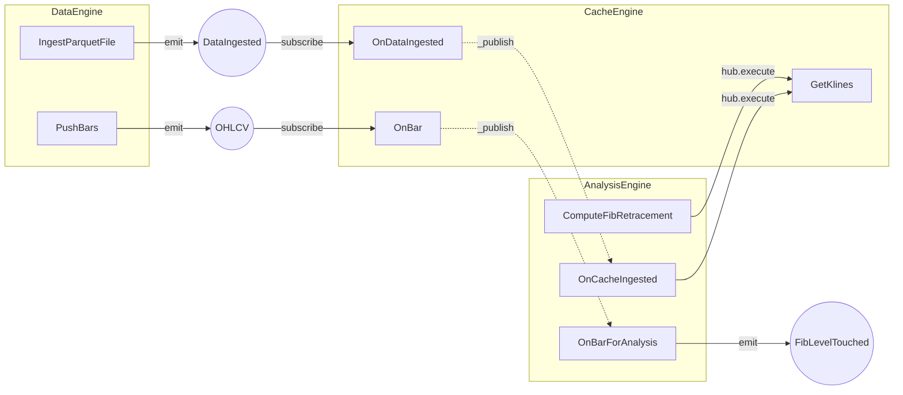

# Timing 交易系统架构文档

本文档为**整体架构**与**引擎层**的单一事实来源，便于逐项检查与后续实现对齐。设计参考 [NautilusTrader Architecture](https://nautilustrader.io/docs/latest/concepts/architecture/) 与 [Adapters](https://nautilustrader.io/docs/latest/concepts/adapters/)。

**文档索引**：本仓库 timing 架构与 bollydog 适配说明以 `docs/` 为准——[`timing/docs/ARCHITECTURE.md`](ARCHITECTURE.md)（本文）、[`timing/docs/ANALYSIS_BOLLYDOG_FIT.md`](ANALYSIS_BOLLYDOG_FIT.md)；bollydog 侧见 [`bollydog/docs/todo.md`](../../bollydog/docs/todo.md)、[`bollydog/docs/SKILL.md`](../../bollydog/docs/SKILL.md)。

**服务模型**：Hub 及以下各层中，**每个引擎**均为独立 `bollydog.AppService`；**每个引擎内部的每个组件**均为独立 `bollydog.AppService`，作为该引擎的**子服务**（通过引擎的 `add_dependency(component)` 或引擎级 `add_service(component)` 挂载，与 Hub 挂载引擎方式一致）。

### 代码包布局（当前实现）

| 路径 | 角色 |
|------|------|
| [`timing/engine/clock.py`](../engine/clock.py) | **Clock**：`LiveClock`（生产）、`SimulatedClock`（回测）；`config.yaml` 中 `clock: !module ...` 传入类名，`TimingApp` 会实例化 |
| [`timing/models/`](../models/) | **数据类型**：`OHLCV`（BaseCommand）、`Bar`/`Kline`（别名） |
| [`timing/data/`](../data/) | **行情接入**：`DataEngine`、`timing.data.models`（`DataIngested`/`PushBars`/`IngestParquetFile`）、[`FileParquetDataClient`](../data/clients/file_parquet.py)（duckdb 读 Parquet，按 `ts` 去重，不写回文件） |
| [`timing/analysis/`](../analysis/) | **分析**：[`algo/`](../analysis/algo/) 纯算法（dict）；`AnalysisEngine` 注入 Clock；`models.py` 中 Command/Event/Handler |
| [`timing/engine/`](../engine/) | **`cache.py`**、`clock.py`、**`app.py`**（`TimingApp` 唯一入口，Cache→Data→Analysis 启动顺序） |
| [`timing/execution/`](../execution/)、[`timing/risk/`](../risk/) | **预留** ExecutionEngine / RiskEngine |

---

## 1. 整体架构

### 1.1 架构图

```
                    ┌─────────────────────────────────────────────────────────┐
                    │                    Entrypoints                          │
                    │   HTTP API │ WebSocket (行情/指令) │ CLI │ 定时任务      │
                    └─────────────────────────┬───────────────────────────────┘
                                              │
                    ┌─────────────────────────▼───────────────────────────────┐
                    │                      Hub (bollydog)                      │
                    │   Queue(消息队列) │ Exchange(主题发布/订阅) │ Session     │
                    └─────────────────────────┬───────────────────────────────┘
                                              │
     ┌────────────────────────────────────────┼────────────────────────────────────────┐
     │                    │                   │                    │                    │
     ▼                    ▼                   ▼                    ▼                    ▼
┌─────────┐        ┌─────────────┐     ┌──────────┐        ┌─────────────┐      ┌──────────┐
│ Data    │        │ Market      │     │ Analysis │        │ Execution   │      │ Risk     │
│ Engine  │───────▶│ Data/Cache  │────▶│ Engine   │        │ Engine      │      │ Engine   │
│(行情接入)│        │(K线/快照)   │     │(指标/回撤)│        │(下单/回报)   │      │(预检)    │
└─────────┘        └─────────────┘     └──────────┘        └─────────────┘      └──────────┘
     │                     │                   │                    │                    │
     └─────────────────────┴───────────────────┴────────────────────┴────────────────────┘
                                              │
                    ┌─────────────────────────▼───────────────────────────────┐
                    │              Adapters (bollydog + timing)                │
                    │   Redis │ RDB │ 行情 DataClient 适配器 │ 券商 ExecutionClient  │
                    └─────────────────────────────────────────────────────────┘
```

### 1.2 分层与子系统/组件清单

以下每一层的**子系统/组件**均需在实现时对应到具体服务或模块；其中引擎及其组件均以 `bollydog.AppService` 形式存在。

#### 1.2.1 Entrypoints（入口层）

| 子系统/组件 | 说明 | 实现形态 |
|-------------|------|----------|
| **HTTP API** | REST 请求入口，将请求转为 Command 交给 Hub | bollydog HttpService（Starlette） |
| **WebSocket** | 行情/指令长连接，推拉结合 | bollydog SocketService |
| **CLI** | 命令行入口、脚本与运维 | bollydog entrypoint.cli |
| **定时任务** | 定时触发的 Command（如定时拉 K 线） | 可选：cron + Command 或内置 Scheduler 服务 |

#### 1.2.2 Hub（bollydog）

| 子系统/组件 | 说明 | 实现形态 |
|-------------|------|----------|
| **Hub** | 总入口 AppService，挂载 Queue、Exchange、Session 与业务引擎 | bollydog.service.app.Hub |
| **Queue** | 消息队列（qos=1 Command 入队消费） | bollydog.service.queue.Queue（Hub 的 dependency） |
| **Exchange** | 主题路由（AMQP 风格 `*`/`#`），Command 执行后按 `destination` 匹配订阅 | bollydog.service.exchange.Exchange（Hub 的 dependency；`subscribe` 勿与实例属性命名冲突） |
| **Session** | 会话/上下文管理 | bollydog.service.session.Session（Hub 的 dependency） |
| **DataEngine** | 行情接入引擎（见 §2.1） | timing 引擎，Hub 通过 add_service 挂载 |
| **Market Data/Cache** | K 线、快照存储引擎（见 §2.2） | timing 引擎，Hub 通过 add_service 挂载 |
| **Analysis Engine** | 指标、斐波那契回撤、触线检测（见 §2.3） | timing 引擎，Hub 通过 add_service 挂载 |
| **ExecutionEngine** | 下单/回报（预留） | timing 引擎，Hub 通过 add_service 挂载 |
| **RiskEngine** | 预检（预留） | timing 引擎，Hub 通过 add_service 挂载 |

#### 1.2.3 Engines（引擎层，四类引擎）

引擎层**仅包含以下四个引擎**，每个引擎为一个独立 `bollydog.AppService`；每个引擎内部的每一项「组件」为一个独立 `bollydog.AppService`，作为该引擎的子服务。

| 引擎 | 职责 | 组件（子服务 AppService） | 当前状态 |
|------|------|---------------------------|----------|
| **DataEngine** | 行情接入 | 见 §2.1 | 设计完成，见 §3 |
| **Market Data/Cache** | K 线、快照存储 | 见 §2.2 | 接口预留 |
| **Analysis Engine** | 指标、斐波那契回撤、触线检测 | 见 §2.3 | **首期只做本引擎** |
| **ExecutionEngine / RiskEngine** | 下单/回报；预检 | 预留 | 预留 |

#### 1.2.4 Adapters（适配器层）

| 子系统/组件 | 说明 | 实现形态 |
|-------------|------|----------|
| **Redis** | 缓存/会话等 | bollydog.adapters.redis |
| **RDB** | 关系型存储 | bollydog.adapters.rdb |
| **行情 Client 适配器** | 各数据源实现（List/File/…），子 AppService | timing.data.clients.* |
| **券商 ExecutionClient** | 下单与回报（预留） | 预留 |

### 1.3 数据流 / 指令流 / 事件流

- **数据流**：外部行情 → DataClient（子 AppService）→ DataEngine → `hub.emit(OHLCV(...))` → Exchange 按 topic 匹配 → Cache/Analysis 等 `AppService.subscribe` 声明的 Handler Command。
- **指令流**：Command 经 Hub（Queue 或直执）→ 目标 `destination` 对应 AppService → `__call__`。
- **事件流**：`BaseEvent` 与 Command 执行后的 `_publish` 均按 `type(message).destination` 作为 topic 在 Exchange 上匹配；订阅者为 `BaseCommand` 子类，实例化后 `add_event` 再 `dispatch`。
- **destination 约定**：`domain.alias.CommandName`；前两段解析 `_resolve_app`（选 AppService 与 protocol 上下文），整段字符串作 Exchange 匹配 topic；timing 内 Command/Event 已显式设置 `destination` 以避免 import 顺序导致 `_._` 未改写。

---

## 2. 引擎层定义与组件（AppService 模型）

引擎层仅包含以下**四个引擎**。每个引擎 = 一个 `bollydog.AppService`；每个引擎下列出的**组件** = 一个 `bollydog.AppService`，作为该引擎的**子服务**（由引擎通过 `add_dependency` 或引擎级 `add_service` 挂载）。

### 2.1 DataEngine（行情接入）

- **职责**：管理 DataClient、订阅/请求、接收归一化数据并写入 Cache、向 MessageBus 发布行情事件。
- **组件（每个均为 AppService 子服务）**：

| 组件 | 职责 |
|------|------|
| **DataClientRegistry** | 注册/管理多个 DataClient，转发 request/subscribe 到对应 Client |
| **DataClient 实例**（可选按源拆子服务） | 各数据源实现（List/File/Redis/REST/WS），连接、请求历史、订阅实时、归一化输出 |

实现时 DataEngine 本身为一个 AppService；其内部可持有 Registry + 若干 DataClient 实现类实例，若将「每个 DataClient 连接」拆成独立生命周期，则可把每个 DataClient 实现为 AppService 子服务并由 DataEngine add_dependency。

### 2.2 Market Data/Cache（K 线、快照）

- **职责**：存储 K 线序列（按 symbol+interval）、最新价、可选订单簿快照，供 Analysis/策略查询。
- **组件（每个均为 AppService 子服务）**：

| 组件 | 职责 |
|------|------|
| **KlineStore** | 按 symbol+interval 的 K 线写入与按时间范围查询（get_klines、append_bar） |
| **SnapshotStore**（可选） | 最新价、订单簿快照等，可选实现 |

首期可合并为单一 Cache AppService（仅 KlineStore），后续再拆 SnapshotStore 为独立子服务。

### 2.3 Analysis Engine（指标、斐波那契回撤、触线检测）← 首期只做本引擎

- **职责**：指标计算、Swing 识别、斐波那契回撤线、触线检测等。
- **组件（每个均为 AppService 子服务）**：

| 组件 | 职责 |
|------|------|
| **SwingService** | Swing 拐点识别与选笔（find_swing_highs_lows、select_trend_leg） |
| **FibonacciService** | 斐波那契回撤线计算（retracement_from_leg、retracement_from_klines） |
| **TouchDetectorService** | 触线检测与去抖（check_touch、TouchDetector） |

当前 timing/analysis 为无状态函数与类，接入 bollydog 时：Analysis Engine 为一个 AppService，上述三者可封装为三个 AppService 子服务，由 Analysis Engine add_dependency 挂载。

### 2.4 ExecutionEngine / RiskEngine（预留）

- **ExecutionEngine**：订单路由、生命周期、回报处理；组件预留（如 OrderManager、PositionManager 等）。
- **RiskEngine**：预交易风控检查；组件预留（如 PreTradeRisk、LimitChecker 等）。

两者均为独立 AppService，内部组件在后续设计中再列为 AppService 子服务。

---

## 3. 行情接入层（DataEngine + DataClient）设计

本节为 **DataEngine** 及其组件的详细设计，对齐 NautilusTrader 的 DataEngine / DataClient / 数据流。

### 3.1 设计目标

- 统一从多种数据源（内存、文件、Redis、REST、WebSocket 行情网关）接入行情。
- 将**原始/各源格式**归一化为 timing 内部数据类型（Bar/Kline、Quote、Trade 等）。
- 支持**按需请求**（如历史 K 线）与**订阅推送**（如实时 Tick/Bar）。
- 数据经 DataEngine 写入 Cache 并经由 MessageBus 发布，供 Analysis/策略消费。

### 3.2 与 NautilusTrader 的对应关系（概念）

| NautilusTrader | Timing 实现 | 状态 |
|----------------|-------------|------|
| **TradingNode**（编排） | [`TimingApp`](../../engine/app.py)（`timing.engine.app`，可选单独挂载） | 占位 |
| **DataEngine** | [`timing.data.engine.DataEngine`](../../data/engine.py) | 已有 |
| **DataClient**（适配器） | [`FileParquetDataClient`](../../data/clients/file_parquet.py) 等，各自 `AppService`，**无统一 ABC** | 已有 Parquet |
| **Cache / Catalog** | [`timing.engine.cache.CacheEngine`](../../engine/cache.py) | 已有 |
| **消息总线 / 事件** | bollydog `Hub` + `Exchange`；`OHLCV`（BaseCommand 子类）/`DataIngested` 在 [`timing.data.models`](../../data/models.py) | 已有 |
| **Actor / 策略逻辑** | [`timing.analysis.algo`](../../analysis/algo/)（纯函数/类） | 已有 |
| **Portfolio / Execution** | [`timing.execution`](../../execution/)、[`timing.risk`](../../risk/) | 预留 |
| **InstrumentProvider** | — | 未做 |
| **Order / Position** | — | 未做 |

### 3.2.1 与 Nautilus 设计（旧表，字段级）

| NautilusTrader | Timing 设计 |
|----------------|-------------|
| DataClient（适配器内） | 各 **Client** 实现（List、File 等），**不强制**公共抽象基类 |
| 归一化为 Nautilus 类型（Bar, TradeTick 等） | 归一化为 timing 类型（**Bar/Kline** 在 `timing.models`，见下） |
| request_instrument / request_bars / 回调 | **request_klines**（ListClient）等 |
| subscribe_trade_ticks / subscribe_bars | 后续 WS Client + `OHLCV` |
| DataEngine 接收并路由数据 | **DataEngine** `add_dependency` 各 Client → 写 Cache + 发 Event |

### 3.3 数据流（行情接入）

```
  [ 数据源: 内存/文件/Redis/交易所API ]
              │
              ▼
  ┌─────────────────────────────────────┐
  │  DataClient (适配器实现，可为子服务)   │
  │  - 连接/断开                          │
  │  - 请求历史: request_klines(...)     │
  │  - 订阅实时: subscribe_bars / ticks   │
  │  - 归一化: 原始格式 → timing 数据类型  │
  └─────────────────────────┬───────────┘
                            │ 回调 / 异步推送
                            ▼
  ┌─────────────────────────────────────┐
  │  DataEngine (AppService)             │
  │  - 注册/管理多个 DataClient（子服务）  │
  │  - 转发请求到对应 Client             │
  │  - 接收归一化数据 → 写 Cache          │
  │  - 发布 Bar/Tick 等 Event 到 Router  │
  └─────────────────────────┬───────────┘
                            │
        ┌───────────────────┼───────────────────┐
        ▼                   ▼                   ▼
  Market Data/Cache    MessageBus(Router)    [ 日志/监控 ]
  (K线/快照持久化)      (OHLCV/TickEvent)
        │                   │
        ▼                   ▼
  [ 按需查询 ]        [ Analysis / 策略 订阅 ]
```

### 3.4 组件定义

#### 3.4.1 数据类型（归一化后）

| 类型 | 说明 | 字段（草案） |
|------|------|--------------|
| **Bar / Kline** | `timing.models.Kline`（OHLCV + ts） | open, high, low, close, volume, ts_ms |
| **Quote** | 买卖盘快照（可选） | bid, ask, bid_qty, ask_qty, ts_ms |
| **Trade** | 成交/逐笔（可选） | price, qty, side, ts_ms |

首期以 **Bar/Kline** 为主；Quote/Trade 可后续扩展。

#### 3.4.2 行情 Client（实现各自约定方法，无统一 ABC）

- 各 Client 为 `AppService`，按需实现 `request_klines` / `read_klines` 等；**不**强制继承公共 `DataClient` 抽象。
- 新增 Redis/REST/WS 时在 `timing.data.clients` 下增加模块，由 `DataEngine` `add_dependency`。

#### 3.4.3 DataEngine（AppService）

- **注册 DataClient**：`register_client(client: DataClient)`，可按 venue/source 标识；Client 可为 AppService 子服务。
- **请求转发**：`request_klines(source_id, symbol, interval, start_ts, end_ts)` 转发到对应 Client，结果写 Cache 并可选发布事件。
- **订阅管理**：`subscribe_bars(symbol, interval)` 在对应 Client 上建立订阅；收到数据 → `emit(OHLCV(...))` 至 Exchange。
- **与 Hub 对接**：通过 bollydog Exchange 发布 OHLCV（BaseCommand 子类，单 bar）/ DataIngested（BaseEvent，批量），下游 Cache/Analysis 通过 `subscribe` 注册 Handler。

#### 3.4.4 Market Data / Cache（AppService，见 §2.2）

- **职责**：存储最新 K 线序列（按 symbol+interval）、最新价、可选订单簿快照。
- **接口（草案）**：`get_klines(symbol, interval, start_ts, end_ts)`；`append_bar(symbol, interval, bar)`；可选 `get_last_price(symbol)`。
- **首期**：可与现有 `KlineSource` / 内存列表并存；后续可接 Redis 等。

### 3.5 目录与接口清单（行情接入层）

| 层级 | 路径/模块 | 内容 |
|------|-----------|------|
| **数据类型** | `timing/models/kline.py` | `OHLCV`/`Bar`/`Kline` |
| **DataEngine 模型** | `timing/data/models.py` | `DataIngested`、`PushBars`、`IngestParquetFile`；OHLCV 在 `timing.models.kline` |
| **Client 实现** | `timing/data/clients/` | `FileParquetDataClient`；后续按需增加 |
| **DataEngine** | `timing/data/engine.py` | `DataEngine`（AppService）、`router_mapping` |
| **Cache** | `timing/engine/cache.py` | `CacheEngine`、`GetKlines`、`OnBar`、`OnDataIngested` |
| **中枢（可选）** | `timing/engine/app.py` | `TimingApp` |

### 3.6 检查项（行情接入层）

- [x] **无统一 DataClient ABC**：各 Client 自洽。
- [x] **DataEngine（AppService）**：Command 只 `emit`（`OHLCV`/`DataIngested`），不直接操作 CacheEngine。
- [ ] **实时长连接订阅**：交易所 WebSocket 等 → 另增 DataClient 实现与可选 Command（首期未做）。
- [x] **CacheEngine（AppService）**：`subscribe` 订阅 `OHLCV`→`OnBar`（写 Cache）、`DataIngested`→`OnDataIngested`（批量替换 + 返回 revision）；handler 完成后 `_publish` 自动广播 destination。内部存 `List[dict]`。
- [x] **AnalysisEngine（AppService）**：**不**订阅 `OHLCV`；只订阅 `timing.CacheEngine.OnBar`→`OnBarForAnalysis`（Cache 写入后再从 Cache 读最新价触线）、`timing.CacheEngine.OnDataIngested`→`OnCacheIngested`（批量重算）。注入 Clock。
- [x] **数据类型与 Exchange**：`OHLCV(BaseCommand)` destination=`timing.DataEngine.OHLCV`；`DataIngested.destination=timing.DataEngine.DataIngested`。
- [x] **Clock**：`timing/engine/clock.py`；`config.yaml` 可写 `clock: !module timing.engine.clock.LiveClock` 或 `SimulatedClock`（类，由 `TimingApp` 实例化）。
- [x] **TimingApp 统一入口**：`config.yaml` 只声明 TimingApp + clock 类；内部 CacheEngine → DataEngine → AnalysisEngine。
- [x] **文档与计划**：与 `config.yaml`、`demo.py` 对齐；CLI：`cd <repo_root> && PYTHONPATH=. bollydog … --config config.yaml`。

### 3.7 Analysis 命令如何组合（主逻辑）

以下均在 `timing.analysis.models`；**斐波那契档位**与**触线**是两条路径：**批量/主动算档** vs **实时触线信号**。

| 名称 | 类型 | 何时触发 | 入参（要点） | 返回 / 副作用 |
|------|------|----------|--------------|----------------|
| **ComputeFibRetracement** | Command | 人工或策略 `hub.execute` | `symbol`, `interval`, `start_ts`/`end_ts`, `direction`, swing 窗口 | `GetKlines`→ swing 找腿→`retracement_from_leg`→`AnalysisEngine.set_fib_state`；返回 `leg` + `levels` 列表 |
| **OnCacheIngested** | Handler | 订阅 `timing.CacheEngine.OnDataIngested`（批量 ingest 且 Cache `replace_klines` 完成后） | 无直接字段，从 handler 链 `state[1]` 取 symbol/interval/revision | `GetKlines` 全量→同上算 fib→`set_fib_state`；返回摘要（含 `revision`） |
| **OnBarForAnalysis** | Handler | 订阅 `timing.CacheEngine.OnBar`（单根 OHLCV 已写入 Cache 后） | 从链上事件解析 symbol/interval；**成交价**取 **Cache 最后一根** 的 `close` | 若已有 fib 档位：`TouchDetector.check`（Clock 控制冷却）→ 命中则 **`emit(FibLevelTouched)`**；返回触中的 `(ratio, price)` 列表 |
| **FeedPrice** | Command | 测试或外部显式喂价 | `symbol`, `price`, `levels`, `tolerance` | 不读 Cache；直接对给定 `levels` 做几何触线→可 `emit(FibLevelTouched)` |

**组合关系**：先有 **档位**（`ComputeFibRetracement` 或 **OnCacheIngested** 批量重算），**OnBarForAnalysis** 才能在后续每根 K 线上用最新 `close` 去碰这些档并发 **`FibLevelTouched`**。若从未算过档，`OnBarForAnalysis` 直接跳过（无 levels）。

---

## 4. Cache、磁盘文件与事件一致性

**根因**：磁盘 Parquet 为静态快照；内存 Cache 为真相查询面；事件经 Exchange 异步派发。DataEngine Command **只 emit 事件**，不直接操作 CacheEngine。CacheEngine 通过 `subscribe` 订阅事件并写入 Cache。

**约定**：

1. **查询与计算真相源**：`ComputeFibRetracement` 等以 **`GetKlines` / Cache** 为准，不以「仅拼事件流」重建序列为准。
2. **批量 Parquet ingest**：`IngestParquetFile` 读文件 → `emit(DataIngested(klines=...))`。CacheEngine 订阅 `DataIngested` 执行 `replace_klines`。AnalysisEngine 订阅 CacheEngine handler completion（`timing.CacheEngine.OnDataIngested`）后从 Cache 读数据重算。
3. **实时推送**（`PushBars`）：逐条 `emit(OHLCV(...))`。CacheEngine `OnBar` 写 Cache → `_publish` 以 `timing.CacheEngine.OnBar` 广播；AnalysisEngine `OnBarForAnalysis` **仅**在此之后触发，并从 **Cache** 读取该 symbol/interval 最新一根的 `close` 做触线（避免与 Cache 竞态）。
4. **revision**：`CacheEngine.replace_klines` 递增 revision，通过 `OnDataIngested` handler 返回值（`state[1]`）自动随 `_publish` 传播给下游。

### 4.1 handler 完成即广播（bollydog 机制）

bollydog `_fire` 中 `_run` 执行完 `__call__` 后立即 `_publish`，以 handler 的 `destination` 为 topic 广播。下游可订阅任何 handler 的 destination，收到时上游已执行完毕，`get_event(-1)["state"]` 含 `["FINISHED", return_value]`。

**何时用显式 Event vs 订阅 handler completion：**

| 场景 | 用什么 | 理由 |
|------|--------|------|
| 数据源头产出 | `OHLCV`（BaseCommand）/ `DataIngested`（BaseEvent） | 业务数据/事件，多 Service 关心 |
| 链式依赖（等上游写完再算） | 订阅 handler destination | 零额外定义，`_publish` 天然支持 |
| 对外通知（触线、成交） | 显式 Event（`FibLevelTouched`） | 外部消费者不应知道内部 handler |

---

## 5. 命令/事件/订阅拓扑

### 5.1 事件流拓扑图



虚线 = bollydog `_publish` 自动广播（handler 完成后以 destination 为 topic，不需要显式 emit）。

### 5.2 DataEngine（[`timing/data/`](../data/)）

**定义：**

| 类型 | 名称 | destination | payload |
|------|------|-------------|---------|
| Command | `PushBars` | `timing.DataEngine.PushBars` | symbol, interval, bars |
| Command | `IngestParquetFile` | `timing.DataEngine.IngestParquetFile` | path, symbol, interval |
| Data | `OHLCV` | `timing.DataEngine.OHLCV` | symbol, interval, open, high, low, close, volume, ts |
| Event | `DataIngested` | `timing.DataEngine.DataIngested` | symbol, interval, klines, source |

订阅：无。emit：`OHLCV`（仅 CacheEngine.OnBar 订阅）、`DataIngested`（CacheEngine.OnDataIngested）。Analysis 不直连 `OHLCV`，只订阅 `OnBar` / `OnDataIngested` 的 handler 完成广播。

### 5.3 CacheEngine（[`timing/engine/cache.py`](../engine/cache.py)）

**定义：**

| 类型 | 名称 | destination | 返回值 |
|------|------|-------------|--------|
| Command | `GetKlines` | `timing.CacheEngine.GetKlines` | `List[dict]` |
| Handler | `OnBar` | `timing.CacheEngine.OnBar` | `True` |
| Handler | `OnDataIngested` | `timing.CacheEngine.OnDataIngested` | `{"revision", "rows", "symbol", "interval"}` |

无显式 Event。handler 返回后 `_publish` 自动广播 destination。内部存 `List[dict]`。

**订阅（入）：**

| topic | Handler | 行为 |
|-------|---------|------|
| `timing.DataEngine.OHLCV` | `OnBar` | event 取 open/high/low/close/volume/ts → `append_bar` |
| `timing.DataEngine.DataIngested` | `OnDataIngested` | event 取 klines → `replace_klines` → 返回含 revision 的 dict |

**_publish 自动广播（出）：**

| topic | state[1] | 被谁订阅 |
|-------|----------|---------|
| `timing.CacheEngine.OnBar` | `True` | **AnalysisEngine.OnBarForAnalysis** |
| `timing.CacheEngine.OnDataIngested` | `{"revision": N, "rows": M, "symbol": ..., "interval": ...}` | **AnalysisEngine.OnCacheIngested** |

### 5.4 AnalysisEngine（[`timing/analysis/`](../analysis/)）

**定义：**

| 类型 | 名称 | destination | payload |
|------|------|-------------|---------|
| Command | `ComputeFibRetracement` | `timing.AnalysisEngine.ComputeFibRetracement` | symbol, interval, ... |
| Command | `FeedPrice` | `timing.AnalysisEngine.FeedPrice` | symbol, price, levels, tolerance |
| Handler | `OnBarForAnalysis` | `timing.AnalysisEngine.OnBarForAnalysis` | - |
| Handler | `OnCacheIngested` | `timing.AnalysisEngine.OnCacheIngested` | - |
| Event | `FibLevelTouched` | `timing.AnalysisEngine.FibLevelTouched` | symbol, ratio, level_price, touch_price |

**订阅（入）：**

| topic | Handler | 传播方式 | 行为 |
|-------|---------|---------|------|
| `timing.CacheEngine.OnBar` | `OnBarForAnalysis` | _publish（OnBar 完成后） | 从 Cache 读最新 `close` → 触线检测（与 Cache 一致） |
| `timing.CacheEngine.OnDataIngested` | `OnCacheIngested` | _publish 自动广播 | 检查 state → GetKlines → 重算 fib |

**显式 emit（出）：** `FibLevelTouched`（被 ExecutionEngine 预留订阅）。

### 5.5 ExecutionEngine / RiskEngine（预留）

- Execution 订阅 `timing.AnalysisEngine.FibLevelTouched` 或 handler completion
- Risk 订阅 Execution handler/event

---

## 6. 文档维护

- **整体架构**：以本文 §1 为准；若调整分层或框图，同步更新 task_plan.md 中的架构图引用或精简版。
- **引擎层**：仅包含四个引擎（DataEngine、Market Data/Cache、Analysis Engine、ExecutionEngine/RiskEngine）；每个引擎及其组件均为 bollydog AppService/子服务，以 §2 与 §1.2.3 为准。
- **各层子系统/组件**：以 §1.2 各表为准，新增或更名时同步更新表格。
- **检查项**：§3.6 为行情接入层检查清单；Execution/Risk 等层设计时补充对应检查项。
