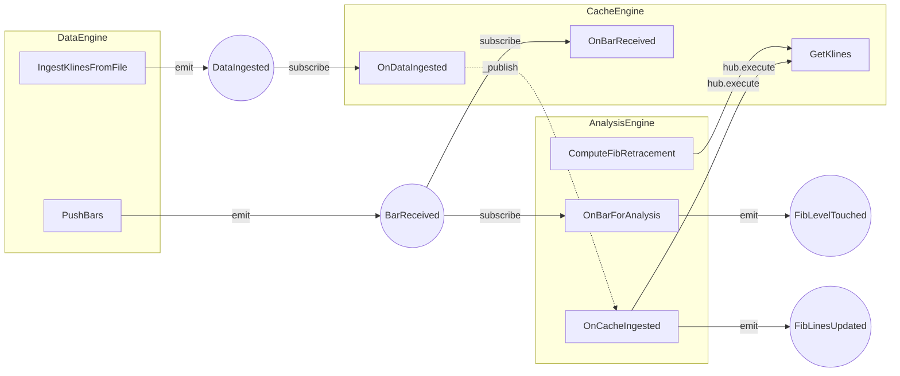

**Timing 交易系统**

信息架构设计文档

*Information Architecture Document · v1.0*

受众：架构师 / AI 开发代理

用途：指导各模块的具体实现

参考：NautilusTrader Architecture

# **1. 设计哲学与核心原则**

## **1.1 首要目标：回测与生产代码完全一致**

系统的最高设计约束是：策略逻辑、分析逻辑、风控逻辑在回测与生产环境中一字不改地运行。为实现这一目标，所有环境差异必须收敛到两个唯一的替换点：

| **替换点** | **回测实现** | **生产实现** | **影响范围** |
| --- | --- | --- | --- |
| Clock（时钟） | SimulatedClock 随数据时间戳推进 | LiveClock 等于系统时钟 UTC | 任何需要「当前时间」的组件 |
| DataClient（数据客户端） | FileParquetDataClient（回测/批量） | BinanceWebSocketClient 或其他交易所适配器 | DataEngine 内部，其他引擎无感知 |

## **1.2 六项核心设计原则**

### **原则 A：单线程事件循环（确定性顺序）**

系统边界内所有组件运行在单一事件循环上。每个事件从进入到处理完毕是原子性的，不存在并发处理两个事件的情况。这保证了回测可复现，生产行为可预测。

|  |
| --- |
| ✅ 正确：事件 A 完全处理完 → 事件 B 进入处理  ❌ 错误：事件 A 处理中途，事件 B 抢占执行 |

### **原则 B：MessageBus 是唯一通信通道**

任何两个组件之间不得持有对方的直接引用。所有通信通过 bollydog Exchange（MessageBus）以事件/命令传递。组件只需知道 topic 名称，不需要知道发送方或接收方是谁。

### **原则 C：Cache 是唯一数据真相源**

所有组件查询历史数据必须通过 CacheEngine，不允许在组件内部维护数据副本。这使得回测重置只需清空一个地方，避免状态泄漏。

### **原则 D：Clock 注入，禁止直接调用系统时钟**

任何组件内部需要当前时间时，必须使用注入的 Clock 实例，禁止调用 datetime.now() 或 time.time()。

|  |
| --- |
| ❌ 错误：elapsed = datetime.now() - self.last\_touch\_time  ✅ 正确：elapsed = self.clock.now() - self.last\_touch\_time |

### **原则 E：「发生了什么」与「应该做什么」严格分离**

AnalysisEngine 只负责感知市场状态并发出事件（「发生了什么」）。Strategy 订阅这些事件并做交易决策（「应该做什么」）。两者不得混合。

### **原则 F：组件统一生命周期（状态机）**

每个 AppService 组件必须实现标准生命周期钩子：on\_start / on\_stop / on\_reset / on\_dispose。on\_reset 必须将组件内部状态完全清零，保证多轮回测结果互不污染。

# **2. 系统总览**

## **2.1 分层架构**

系统共分五层，从外到内依次为：入口层、Hub 层、引擎层、策略层、适配器层。

| **层级** | **组件** | **职责概述** |
| --- | --- | --- |
| Entrypoints 入口层 | HTTP API / WebSocket / CLI / 定时任务 | 将外部请求转为 Command 交给 Hub |
| Hub 层 | bollydog Hub Queue / Exchange / Session | 消息路由中枢，管理所有引擎的挂载与通信 |
| 引擎层 | DataEngine / CacheEngine AnalysisEngine / ExecutionEngine / RiskEngine | 各业务领域的核心计算单元，每个引擎为独立 AppService |
| 策略层 | FibStrategy（及未来其他策略） | 消费分析事件，做交易决策，发出订单命令 |
| 适配器层 | DataClient 适配器 Execution 适配器 / Redis / RDB | 对接外部系统，向内只说系统标准语言 |

## **2.2 消息类型三分法**

系统内流动的消息严格分为三种类型，不允许混用：

| **类型** | **方向** | **示例** | **语义** |
| --- | --- | --- | --- |
| Data（数据） | DataEngine → Cache / Analysis | BarReceived, DataIngested | 市场发生了什么数据事实 |
| Event（事件） | 引擎/服务 → 订阅者 | FibLinesUpdated, FibLevelTouched, OrderFilled | 系统内部状态发生了变化 |
| Command（命令） | 任意发起方 → 目标 AppService | SubmitOrder, CancelOrder, PushBars, IngestKlinesFromFile | 请求某个组件执行某个动作 |

## **2.3 回测 vs 生产：差异全景**

| **维度** | **回测** | **生产** | **谁处理差异** |
| --- | --- | --- | --- |
| 时间控制权 | SimulatedClock，随 bar 时间戳推进 | LiveClock，等于 UTC 系统时钟 | Clock 抽象 |
| 数据来源 | Parquet 文件 | 交易所 WebSocket 实时推送 | DataClient 实现 |
| Bar 状态 | 全部为已关闭的 closed bar | 区分 running bar 与 closed bar | DataClient 内部处理 |
| 数据完整性 | 保证有序、完整、无重复 | 可能乱序、重复、缺失 | LiveDataClient 内部校验 |
| 执行撮合 | SimulatedExchange 内存撮合 | 真实交易所 REST/WebSocket | ExecutionClient 实现 |
| TouchDetector 去抖 | 几乎不需要，信号精确 | 核心机制，必须依赖 | 组件内部，通过 Clock 实现 |

# **3. 引擎层详细设计**

## **3.1 DataEngine（行情接入引擎）**

职责：管理 DataClient，统一从多种数据源接入行情，归一化为内部数据类型，写入 Cache 并向 MessageBus 发布行情事件。DataEngine 本身不做任何计算，只做搬运和归一化。

### **3.1.1 子服务（AppService）**

| **子服务** | **职责** | **当前状态** |
| --- | --- | --- |
| DataClientRegistry | 注册/管理多个 DataClient，按请求转发到对应 Client | 设计完成 |
| FileParquetDataClient | 读取 Parquet 文件，批量 emit DataIngested 事件 | 实现完成 |
| BinanceWebSocketClient（预留） | 连接交易所 WS，处理重连/断线补数据，emit BarReceived | 预留 |

### **3.1.2 命令与事件**

| **类型** | **名称** | **destination** | **payload 核心字段** |
| --- | --- | --- | --- |
| Command | PushBars | timing.DataEngine.PushBars | symbol, interval, bars[] |
| Command | IngestKlinesFromFile | timing.DataEngine.IngestKlinesFromFile | path, symbol, interval |
| Event（emit） | BarReceived | timing.DataEngine.BarReceived | symbol, interval, bar（单根） |
| Event（emit） | DataIngested | timing.DataEngine.DataIngested | symbol, interval, klines[] |

### **3.1.3 LiveDataClient 实现要点（生产专用）**

* 连接断开后必须先用 REST 拉取缺失历史 bar，再切换回 WS 实时订阅（断线补数据逻辑）
* 收到 bar 必须校验：时间戳是否比 Cache 最新一根更新；是否已存在（去重）
* 区分 running bar（当前未关闭）与 closed bar，只将 closed bar emit 为 BarReceived

## **3.2 CacheEngine（行情缓存引擎）**

职责：系统内唯一的数据真相源。存储 K 线序列（按 symbol+interval），供 AnalysisEngine 和 Strategy 查询。不做任何计算，只做存储与查询。

### **3.2.1 命令与 Handler**

| **类型** | **名称** | **destination** | **行为 / 返回值** |
| --- | --- | --- | --- |
| Command | GetKlines | timing.CacheEngine.GetKlines | 返回 List[Kline]，按时间范围过滤 |
| Handler（订阅入） | OnBarReceived | timing.CacheEngine.OnBarReceived | 将单根 bar append 到对应序列，返回 True |
| Handler（订阅入） | OnDataIngested | timing.CacheEngine.OnDataIngested | 整体替换序列，revision+1，返回 {revision, rows, symbol, interval} |

### **3.2.2 revision 机制**

每次 replace\_klines 时 revision 递增。下游（AnalysisEngine）收到 OnDataIngested 的 \_publish 广播时，可通过 revision 判断自己的计算结果对应哪一次写入，防止并发 ingest 场景下的计算结果与数据版本不匹配。首期单线程场景下 revision 主要用于日志追踪，多轮回测时可断言版本一致性。

## **3.3 AnalysisEngine（分析引擎）← 首期重点**

职责：感知市场状态，输出分析结果事件。不做任何交易决策。内部维护当前生效的 Fib 线集合（持久状态），两条独立数据流共享此状态。

### **3.3.1 两条数据流**

|  |
| --- |
| 数据流 A（批量触发）：历史数据 ingest → 重新计算 Swing 和 Fib 线 → 更新 active\_fib\_levels → 发出 FibLinesUpdated  数据流 B（实时触发）：每根新 bar 到来 → 检查当前价格 vs active\_fib\_levels → 发出 FibLevelTouched  两条流互不干扰，但共享同一份 active\_fib\_levels 状态。active\_fib\_levels 由流 A 写入，流 B 只读。 |

### **3.3.2 子服务（AppService）**

| **子服务** | **职责** | **状态类型** |
| --- | --- | --- |
| SwingService | 识别 K 线序列中的 Swing 高低点（拐点），选取覆盖足够多拐点的趋势腿 | 无状态纯计算 |
| FibService | 基于趋势腿计算斐波那契回撤线（0.236/0.382/0.5/0.618/0.786） | 无状态纯计算 |
| TouchDetector | 检测当前价格是否触碰某条 Fib 线，判断触碰方向，执行去抖逻辑 | 有状态（需 on\_reset 清零） |

### **3.3.3 内部持久状态**

| **状态字段** | **类型** | **生命周期** | **on\_reset 时** |
| --- | --- | --- | --- |
| active\_fib\_levels | dict[symbol, list[FibLevel]] | 每次 FibLinesUpdated 更新 | 清空为 {} |
| swing\_points | dict[symbol, list[SwingPoint]] | 每次重算时更新 | 清空为 {} |
| touch\_detector 内部去抖状态 | dict[symbol+ratio, TouchState] | 随每根 bar 更新 | 清空为 {} |

### **3.3.4 命令与事件**

| **类型** | **名称** | **destination** | **触发条件 / payload** |
| --- | --- | --- | --- |
| Command | ComputeFibRetracement | timing.AnalysisEngine.ComputeFibRetracement | 手动触发重算；symbol, interval |
| Command | FeedPrice | timing.AnalysisEngine.FeedPrice | 直接喂价格触发触线检测；symbol, price |
| Handler（订阅入） | OnBarForAnalysis | timing.AnalysisEngine.OnBarForAnalysis | 订阅 BarReceived；取 close 做触线检测 |
| Handler（订阅入） | OnCacheIngested | timing.AnalysisEngine.OnCacheIngested | 订阅 CacheEngine.OnDataIngested 完成广播；重算 Fib |
| Event（emit） | FibLinesUpdated | timing.AnalysisEngine.FibLinesUpdated | Fib 线重算完成；symbol, levels[] |
| Event（emit） | FibLevelTouched | timing.AnalysisEngine.FibLevelTouched | 触线发生；symbol, ratio, level\_price, touch\_price, direction |

### **3.3.5 FibLevel 数据结构**

| **字段** | **类型** | **说明** |
| --- | --- | --- |
| ratio | float | 0.236 / 0.382 / 0.5 / 0.618 / 0.786 |
| price | float | 该比率对应的实际价格 |
| direction\_hint | enum | UP（压力位，从下往上碰 = 卖信号）/ DOWN（支撑位，从上往下碰 = 买信号） |
| symbol | str | 所属交易对 |
| interval | str | 所属 K 线周期 |
| computed\_at\_revision | int | 计算时对应的 Cache revision，用于版本校验 |

# **4. 策略层（Strategy）**

策略层是系统内唯一做交易决策的地方。策略不做任何分析计算，只消费 AnalysisEngine 发出的事件，根据内部状态判断是否下单，并向 RiskEngine 发出订单命令。

|  |
| --- |
| 核心边界原则：  Strategy 知道：当前持仓、当前挂单、账户状态  Strategy 不知道：Fib 是怎么算的、K 线数据长什么样、交易所怎么撮合  Strategy 唯一的输入：来自 MessageBus 的事件  Strategy 唯一的输出：发往 RiskEngine 的命令（SubmitOrder / CancelOrder） |

## **4.1 FibStrategy（首期策略实现）**

策略逻辑：在斐波那契回撤线上挂限价单。ratio >= 0.618 的线挂限价空单，ratio <= 0.382 的线挂限价多单。Fib 线更新时撤旧单、重新挂新单。

### **4.1.1 内部状态**

| **状态字段** | **类型** | **说明** | **on\_reset 时** |
| --- | --- | --- | --- |
| current\_levels | list[FibLevel] | 当前生效的 Fib 线（来自最新 FibLinesUpdated） | 清空 |
| pending\_orders | dict[float, OrderId] | ratio → 已提交的挂单 ID，防止重复下单 | 清空（需先撤单） |
| positions | dict[float, Position] | ratio → 已成交的持仓记录 | 清空 |
| last\_lines\_revision | int | 上次处理的 Fib 线对应 Cache revision | 置 0 |

### **4.1.2 事件处理逻辑**

### **on\_fib\_lines\_updated（最重要的触发点）**

* 撤销 pending\_orders 中所有尚未成交的挂单
* 清空 pending\_orders
* 遍历新 levels：ratio >= 0.618 → 提交限价空单；ratio <= 0.382 → 提交限价多单；0.5 不挂单
* 将新提交的 order\_id 记录到 pending\_orders[ratio]

### **on\_order\_filled**

* 通过 order\_id 找到对应的 ratio
* 更新 positions[ratio] 记录成交持仓
* 从 pending\_orders 中移除该 ratio
* 提交止损单（价格设在相邻 Fib 线之外）

### **on\_order\_rejected / on\_order\_cancelled**

* 记录日志，从 pending\_orders 中移除对应记录
* 可选：等待下一次 FibLinesUpdated 时重新挂单，不立即重试

## **4.2 策略与分析引擎的解耦原则**

Strategy 不持有 AnalysisEngine 的任何引用。通信完全通过 MessageBus 事件。这意味着：

* 可以在不修改 Strategy 代码的情况下替换 Fib 计算算法（只要事件格式不变）
* 可以同时运行多个 Strategy 订阅同一个 AnalysisEngine 的事件
* Strategy 完全不知道 active\_fib\_levels 存在哪里，只知道「会收到 FibLinesUpdated 事件」

# **5. RiskEngine（风控引擎）与 ExecutionEngine（执行引擎）**

## **5.1 两层的本质区别**

RiskEngine 和 ExecutionEngine 看似都在「判断是否通过」，但判断对象和职责完全不同：

| **维度** | **RiskEngine** | **ExecutionEngine** |
| --- | --- | --- |
| 判断的问题 | 这笔单「能不能」下？ | 这笔单「怎么」发出去？ |
| 判断依据 | 业务约束（仓位/资金/频率限制） | 技术约束（API rate limit/网络） |
| 失败后果 | 拒绝命令，发回 OrderDenied 事件 | 重试或排队，不修改业务逻辑 |
| 修改频率 | 随风控规则调整（相对稳定） | 随接入的交易所调整 |
| 类比 | 银行信贷审核：该不该借钱 | 银行放款操作：怎么把钱打出去 |

## **5.2 RiskEngine 设计（首期：透传 + 日志）**

首期实现最简风控：所有命令直接放行，仅打印日志。后续逐步增加风控规则，不影响 Strategy 和 ExecutionEngine 代码。

### **5.2.1 命令流转**

* 订阅：timing.Strategy.SubmitOrder
* 检查通过 → emit timing.RiskEngine.OrderApproved，payload 携带原始命令
* 检查拒绝 → emit timing.RiskEngine.OrderDenied，payload 携带拒绝原因（首期不触发）

### **5.2.2 后续可扩展的风控规则**

| **规则类型** | **实现方式** | **优先级** |
| --- | --- | --- |
| 单笔金额上限 | order.quantity \* order.price < max\_notional | 高 |
| 总仓位上限 | sum(positions) < max\_total\_exposure | 高 |
| 下单频率限制 | 滑动窗口计数器：最近 60s 内不超过 N 笔 | 中 |
| 同一 symbol 重复挂单检测 | 检查 pending\_orders 是否已有该 ratio 的单 | 中（Strategy 侧也有此检查） |

## **5.3 ExecutionEngine 设计**

职责：接收经过风控的订单命令，在回测中对接 SimulatedExchange，在生产中对接真实交易所 API。管理订单完整生命周期。

### **5.3.1 回测模式：SimulatedExchange**

* 内存撮合引擎，根据当前 bar 的 OHLCV 决定限价单是否成交
* 限价买单：bar.low <= order.price → 成交（保守模式）
* 限价卖单：bar.high >= order.price → 成交（保守模式）
* 成交后发出 OrderFilled 事件，注入 MessageBus，Strategy 收到

### **5.3.2 生产模式：真实交易所 API**

* 令牌桶限流：平滑发往交易所的 API 请求频率，防止触发交易所 rate limit
* 维护 order\_id 映射：内部 OrderId ↔ 交易所 OrderId
* WebSocket 回报流：实时接收成交回报，转为 OrderFilled 事件
* REST 轮询兜底：WS 回报丢失时，定期 REST 查询订单状态

### **5.3.3 订单生命周期状态机**

| **状态** | **触发条件** | **发出事件** |
| --- | --- | --- |
| SUBMITTED | SubmitOrder 命令发出 | — |
| ACCEPTED | 交易所确认收到订单 | OrderAccepted |
| PARTIALLY\_FILLED | 部分成交 | OrderPartiallyFilled |
| FILLED | 完全成交 | OrderFilled → Strategy 更新持仓 |
| CANCELLED | 撤单成功 | OrderCancelled → Strategy 清除 pending\_orders |
| REJECTED | 交易所拒绝 | OrderRejected → Strategy 清除 pending\_orders |

# **6. 完整事件流拓扑**

## **6.1 批量数据 ingest 流（回测启动 / 历史数据加载）**

触发点：手动 dispatch IngestKlinesFromFile 命令，或回测启动时自动触发。

| **步骤** | **发起方** | **消息** | **接收方** | **结果** |
| --- | --- | --- | --- | --- |
| 1 | Runner / CLI | IngestKlinesFromFile 命令 | DataEngine | 读取 parquet/csv → K 线 |
| 2 | DataEngine | DataIngested 事件（emit） | CacheEngine（订阅） | replace\_klines，revision+1 |
| 3 | CacheEngine | \_publish 自动广播 OnDataIngested 完成 | AnalysisEngine（订阅） | 触发重算 |
| 4 | AnalysisEngine | GetKlines 命令 | CacheEngine | 拉取全量 K 线 |
| 5 | AnalysisEngine 内部 | Swing 识别 → Fib 计算 | — | 更新 active\_fib\_levels |
| 6 | AnalysisEngine | FibLinesUpdated 事件（emit） | Strategy（订阅） | 撤旧单，挂新限价单 |
| 7 | Strategy | SubmitOrder 命令 × N | RiskEngine | 风控检查 |
| 8 | RiskEngine | OrderApproved 事件 | ExecutionEngine | 提交订单 |

## **6.2 实时 bar 到来流（回测回放 / 生产实时）**

触发点：DataClient 推送新的单根 bar。

| **步骤** | **发起方** | **消息** | **接收方** | **结果** |
| --- | --- | --- | --- | --- |
| 1 | DataClient | BarReceived 事件（emit） | CacheEngine（订阅） + AnalysisEngine（订阅） | 并发触发两个 Handler |
| 2a | CacheEngine | OnBarReceived | — | append\_bar，Cache 更新 |
| 2b | AnalysisEngine | OnBarForAnalysis | — | 取 close，检查触线 |
| 3 | AnalysisEngine | FibLevelTouched 事件（emit） （仅触线时） | Strategy（可选订阅） ExecutionEngine（预留） | Strategy 可据此追加逻辑 |

## **6.3 订单成交回流**

| **步骤** | **发起方** | **消息** | **接收方** | **结果** |
| --- | --- | --- | --- | --- |
| 1 | SimulatedExchange / 真实交易所 | 成交回报 | ExecutionEngine | 解析并标准化 |
| 2 | ExecutionEngine | OrderFilled 事件（emit） | Strategy（订阅） | 更新 positions，设止损 |
| 3 | Strategy | SubmitOrder（止损单）命令 | RiskEngine → ExecutionEngine | 挂止损单 |

## **6.4 关键约定：何时用显式 Event，何时订阅 handler completion**

| **场景** | **机制** | **原因** |
| --- | --- | --- |
| 数据源头产出（行情到来） | 显式 Event（BarReceived, DataIngested） | 多个 Service 同时关心，需广播 |
| 链式依赖（等上游写完再算） | 订阅 handler destination（\_publish 自动广播） | 零额外 Event，天然保证顺序 |
| 对外通知（触线、成交） | 显式 Event（FibLevelTouched, OrderFilled） | 外部消费者不应知道内部 Handler 细节 |

# **7. 组件生命周期规范**

每个 AppService 必须实现以下四个钩子方法。Hub 负责按依赖顺序统一调用，不允许组件自己控制启动顺序。

## **7.1 生命周期状态机**

| **状态** | **进入条件** | **允许的转换** |
| --- | --- | --- |
| INITIALIZED | 组件被 new 出来 | → STARTING（调用 start()） |
| STARTING | start() 被调用 | → RUNNING（on\_start() 完成） |
| RUNNING | on\_start() 正常返回 | → STOPPING（调用 stop()） |
| STOPPING | stop() 被调用 | → STOPPED（on\_stop() 完成） |
| STOPPED | on\_stop() 正常返回 | → STARTING（重启） → INITIALIZED（调用 reset()） |

## **7.2 各钩子职责规范**

| **钩子** | **必须做的事** | **禁止做的事** |
| --- | --- | --- |
| on\_start() | 初始化内部状态；向 MessageBus 注册订阅；建立连接（如有） | 访问尚未启动的其他组件 |
| on\_stop() | 取消 MessageBus 订阅；断开连接；持久化需要保存的状态 | 清空内部状态（那是 reset 的职责） |
| on\_reset() | 将所有内部状态字段清零（等同于刚被 new 出来） | 取消订阅（那是 stop 的职责） |
| on\_dispose() | 释放所有资源；此后组件不可再 start | — |

## **7.3 on\_reset 必须清零的状态（按组件）**

| **组件** | **必须清零的字段** |
| --- | --- |
| CacheEngine | klines（{}），revision（0） |
| AnalysisEngine | active\_fib\_levels（{}），swing\_points（{}） |
| TouchDetector | last\_touch\_time（None），touch\_count（0），debounce\_active（False） |
| FibStrategy | current\_levels（[]），pending\_orders（{}），positions（{}），last\_lines\_revision（0） |
| SimulatedExchange | open\_orders（{}），filled\_orders（[]），account\_balance（重置为初始值） |

## **7.4 Hub 启动顺序（依赖顺序）**

Hub 必须按以下顺序调用各组件的 start()，停止时逆序：

* 1. CacheEngine（最先启动，其他所有组件依赖它）
* 2. DataEngine（启动后可以接收数据命令）
* 3. AnalysisEngine（依赖 CacheEngine 的 GetKlines 接口）
* 4. RiskEngine（依赖 AnalysisEngine 的事件存在）
* 5. ExecutionEngine（最后启动，依赖 RiskEngine 放行命令）
* 6. Strategy（最后挂载，所有基础设施就绪后才开始决策）

# **8. AI 开发指南：实现顺序与验证方法**

本节专门面向 AI 开发代理。按以下顺序实现，每阶段完成后必须验证通过才进入下一阶段。

## **8.1 实现顺序**

| **阶段** | **实现内容** | **完成标志** |
| --- | --- | --- |
| 阶段 0 （基础设施） | Clock 抽象（SimulatedClock / LiveClock） BaseComponent 生命周期基类（on\_start/stop/reset/dispose + 状态机） | SimulatedClock.set\_time() 能推进时间；组件状态机转换正确 |
| 阶段 1 （数据链路） | DataEngine（read_file） CacheEngine（含 OnBarReceived / OnDataIngested） | IngestKlinesFromFile → CacheEngine.get\_klines() 返回正确数据 |
| 阶段 2 （分析链路） | SwingService（纯函数） FibService（纯函数） AnalysisEngine.OnCacheIngested → FibLinesUpdated | ingest 后 FibLinesUpdated 事件携带正确 levels |
| 阶段 3 （触线检测） | TouchDetector（含去抖） AnalysisEngine.OnBarForAnalysis → FibLevelTouched FibLevelTouched 携带正确方向（UP\_TO\_DOWN / DOWN\_TO\_UP） | 逐根 bar 回放，在预期价格处触发 FibLevelTouched |
| 阶段 4 （策略层） | FibStrategy（on\_fib\_lines\_updated / on\_order\_filled） SubmitOrder / CancelOrder 命令 RiskEngine（透传模式） | FibLinesUpdated 后 pending\_orders 包含正确数量的挂单 |
| 阶段 5 （执行层） | SimulatedExchange（内存撮合） ExecutionEngine（回测模式） OrderFilled 回流到 Strategy | 完整回测循环：ingest → 挂单 → 触线 → 成交 → 更新持仓 |
| 阶段 6 （生产适配） | LiveClock BinanceWebSocketClient（含断线补数据） LiveExecutionClient（含令牌桶限流） | 回测参数不变，替换 Clock 和 DataClient 后生产运行正常 |

## **8.2 验证方法：最小冒烟测试**

### **验证批量 ingest 链路（阶段 1-2）**

* 准备一段 BTCUSDT 1m 的 Parquet 文件，包含至少 200 根 K 线
* dispatch IngestKlinesFromFile 命令
* 断言：CacheEngine.get\_klines() 返回正确数量的 Kline
* 断言：FibLinesUpdated 事件被发出，levels 列表包含 5 条线（0.236/0.382/0.5/0.618/0.786）
* 断言：每条线的 price 在历史数据的高低点范围内

### **验证实时触线链路（阶段 3）**

* 在已有 active\_fib\_levels 的前提下，逐根推送 bar
* 构造一根 bar，其 close 价格正好穿越某条 Fib 线
* 断言：FibLevelTouched 事件被发出，direction 正确（从上方碰线 = UP\_TO\_DOWN = 买信号）
* 再推送同一价格的 bar，断言去抖生效，FibLevelTouched 不重复发出

### **验证完整回测循环（阶段 5）**

* 使用 SimulatedClock，惰性推进时间
* ingest 历史数据 → FibLinesUpdated → Strategy 挂单
* 逐根 bar 回放 → 某根 bar 触发 SimulatedExchange 成交
* 断言：OrderFilled 事件发出，Strategy.positions 包含成交记录
* 断言：第二轮回测前调用 reset()，所有组件状态清零，第二轮结果与第一轮隔离

## **8.3 禁止事项（AI 实现时必须遵守）**

|  |
| --- |
| 1. 禁止在任何引擎/策略代码中调用 datetime.now() 或 time.time()，必须使用注入的 clock.now()  2. 禁止任何两个 AppService 直接持有对方引用，必须通过 MessageBus 通信  3. 禁止 AnalysisEngine 或 Strategy 直接操作 CacheEngine 的内部字典，必须通过 GetKlines 命令查询  4. 禁止 Strategy 做任何 K 线计算（Swing 识别、Fib 计算），这属于 AnalysisEngine 职责  5. 禁止 ExecutionEngine 做任何业务决策（下不下单），它只管「怎么发出去」  6. on\_reset() 方法中禁止遗漏任何持久状态字段，必须完全清零 |

# **9. 代码目录结构**

| **路径** | **内容** | **对应架构层** |
| --- | --- | --- |
| timing/models/ | Kline、OHLCV、Bar（共享行情数据类型） | 共享数据类型 |
| timing/analysis/types.py | FibLevel、SwingPoint、TouchResult（分析域数据类型） | 引擎层 |
| timing/common/clock.py | Clock 抽象基类，SimulatedClock，LiveClock | 基础设施 |
| timing/common/component.py | BaseComponent（生命周期状态机基类） | 基础设施 |
| timing/data/engine.py | DataEngine（AppService） | 引擎层 |
| timing/data/models.py | BarReceived, DataIngested, PushBars, IngestKlinesFromFile | 引擎层 |
| timing/data/clients/ | FileParquetDataClient、BinanceWebSocketClient（预留） | 适配器层 |
| timing/engine/cache.py | CacheEngine, GetKlines, OnBarReceived, OnDataIngested | 引擎层 |
| timing/analysis/engine.py | AnalysisEngine（AppService） | 引擎层 |
| timing/analysis/algo/swing.py | Swing 拐点与趋势腿（纯函数） | 引擎层 |
| timing/analysis/algo/fibonacci.py | 斐波那契回撤（纯函数） | 引擎层 |
| timing/analysis/algo/touch.py | TouchDetector（有状态） | 引擎层 |
| timing/analysis/models.py | FibLinesUpdated, FibLevelTouched, ComputeFibRetracement | 引擎层 |
| timing/strategy/fib\_strategy.py | FibStrategy（AppService） | 策略层 |
| timing/strategy/models.py | SubmitOrder, CancelOrder, OrderApproved, OrderDenied | 策略层 |
| timing/risk/engine.py | RiskEngine（AppService，首期透传） | 风控层 |
| timing/execution/engine.py | ExecutionEngine（AppService） | 执行层 |
| timing/execution/simulated.py | SimulatedExchange（回测撮合） | 执行层（回测） |
| timing/engine/app.py | TimingApp / Hub（可选中枢入口） | Hub 层 |

# **10. bollydog 框架适配补充（实现层）**

本节补充 bollydog 框架的具体机制，指导编码实现。设计逻辑以上文各节为准。

## **10.1 消息总线机制**

bollydog Hub = Exchange + Queue + Session。所有 Command/Event 走 Hub.dispatch → Exchange 按 topic 路由。

- **destination 约定**：`domain.alias.CommandName`。前两段用于 `_resolve_app`（选 AppService + protocol 上下文），全段作 Exchange topic。
- **BaseEvent**：走 `create_task(_fire)`；执行后自动 `_publish`。
- **BaseCommand qos=0**：同上。qos=1 入 Queue 消费。
- **`_publish` 自动广播**：`_fire` → `_run(__call__)` → `_publish(message)`，以 `type(message).destination` 为 topic 在 Exchange 匹配订阅者。handler 完成后，订阅者通过 `get_event(-1)["state"]` 获取 `["FINISHED", return_value]`。

## **10.2 handler 完成即广播（链式依赖核心）**

对应 §6.4 的「订阅 handler destination」：

```
Handler A.__call__() 返回 result
  → bollydog _fire 将 result 写入 A.state
  → _publish 以 A.destination 为 topic 广播
  → 订阅 A.destination 的 Handler B 被实例化
  → B.get_event(-1)["state"] = ["FINISHED", result]
```

此机制保证链式依赖的顺序性（如 CacheEngine.OnDataIngested 写完 → AnalysisEngine.OnCacheIngested 读取），零额外 Event 定义。

## **10.3 config.yaml 与 CLI**

```yaml
# config.yaml（仓库根目录）
# clock 传入类引用，TimingApp 构造时实例化；回测改 SimulatedClock
timing:
  app: !module timing.engine.app.TimingApp
  clock: !module timing.common.clock.LiveClock
```

CLI 启动：`cd <repo_root> && PYTHONPATH=. bollydog service --config config.yaml`

`!module` 由 bollydog YAML patch 解析为 `smart_import(path)` 返回的类对象；`create_from` 将 YAML block 中其余 key 作为 kwargs 传入。

## **10.4 CacheEngine 内部存储与 Parquet 读取**

- 内部 `_store: Dict[Tuple[str, str], List[dict]]`，存轻量 dict 而非 Command 对象。
- FileParquetDataClient 使用 duckdb 读取 Parquet，读后按 ts 去重（不修改源文件）。
- `get_klines` 返回 `List[dict]`，algo 纯函数（swing/fibonacci）统一接受 `List[dict]`。

## **10.5 事件流拓扑图（Mermaid）**



虚线 = bollydog `_publish` 自动广播（handler 完成后以 destination 为 topic）。

## **10.6 当前实现状态检查项**

- [x] DataEngine Command 只 emit（BarReceived / DataIngested），不直接操作 CacheEngine
- [x] CacheEngine subscribe：BarReceived → OnBarReceived，DataIngested → OnDataIngested
- [x] AnalysisEngine subscribe：BarReceived → OnBarForAnalysis，CacheEngine.OnDataIngested → OnCacheIngested
- [x] Clock：timing/common/clock.py，config.yaml 传类引用
- [x] TimingApp 统一入口：CacheEngine → DataEngine → AnalysisEngine 启动顺序
- [ ] Strategy 层：FibStrategy 占位
- [ ] Risk / Execution 层：占位
- [ ] 生命周期：BaseComponent on_reset 等占位
