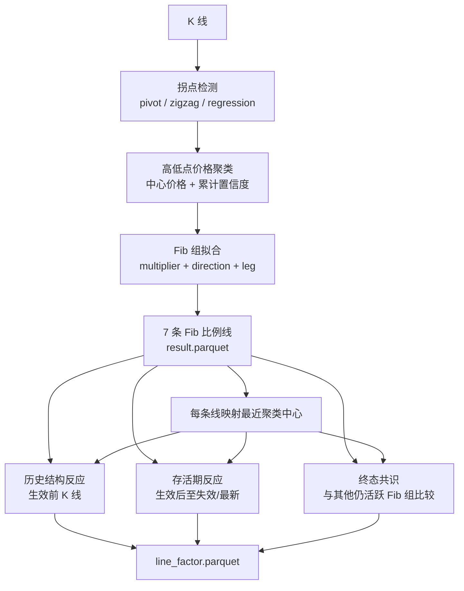
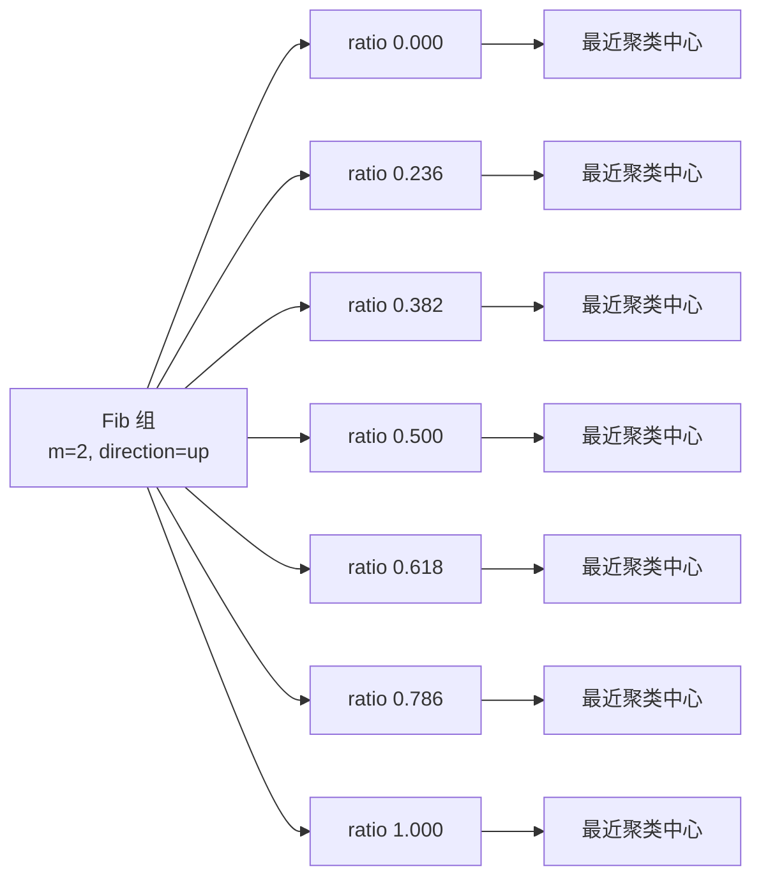
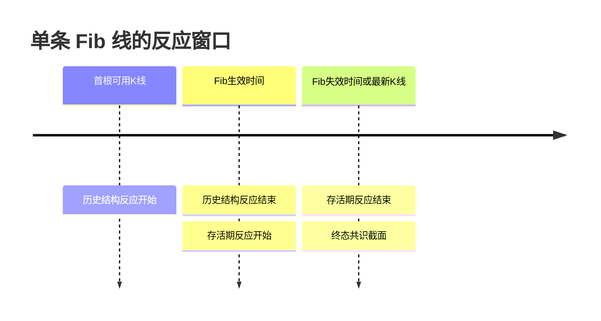
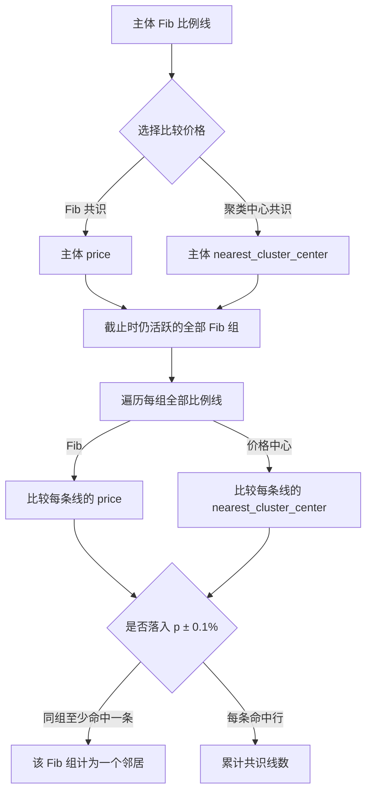

# Line Factor 设计、口径与字段说明

> 正式产物：`warehouse/timing/computation/fib_retracement/{compute_id}/{symbol}/{interval}/line_factor.parquet`
>
> 主产物：同目录 `result.parquet`。Line factor 只从 `result.parquet` 与 K 线派生，**不会重算或修改 Fib result**。

本文覆盖当前 line factor 的完整设计：Fib 组、比例线、聚类中心、历史结构反应、存活期反应、共识、同伴质量、配置、已知限制和实际数据示例。

---

## 1. 要解决什么问题

`result.parquet` 描述“算法在何时得到哪些 Fib 线”；`line_factor.parquet` 描述“这些线对应的价格区域过去是否重要、上线后是否有反应、以及终态时是否与其他仍有效 Fib 组重合”。

它不是交易信号，也不是收益率表。其一行对应 `result.parquet` 的一条 Fib 比例线。



---

## 2. 核心对象与层级

### 2.1 Fib 组是唯一的“组”维度

一个 Fib 组由以下字段唯一标识：

```text
effective_ts + multiplier + direction + leg_low + leg_high
```

- `effective_ts`：组生效时间。
- `multiplier`：时间尺度倍数，当前为 `1 / 2 / 3`。
- `direction`：`up` 或 `down`，决定 Fib 价格公式的方向。
- `leg_low / leg_high`：拟合得到的价格波段。

每个 Fib 组生成 7 条标准比例线：`0、0.236、0.382、0.5、0.618、0.786、1`。



### 2.2 聚类中心不是独立的“聚类中心组”

没有单独的聚类中心组。Fib 组是主维度；每条 Fib 比例线各自挂接一个最近聚类中心。

- 一个 Fib 组内多条比例线可能映射到同一个中心；这叫中心复用。
- 多个不同 Fib 组也可能映射到同一个价格中心。
- 因而“聚类中心线共识”仍然按 Fib 组去重，不会创建另一套组体系。

---

## 3. 聚类中心与置信度从哪里来

### 3.1 单根 K 线的高低点置信度

每根 K 线先经过多种检测器：pivot、zigzag、回归残差等。每个检测器命中会按配置权重贡献证据。

对一根 K 线：

```text
conf_high = 命中的高点检测器权重之和 / 全部检测器权重之和
conf_low  = 命中的低点检测器权重之和 / 全部检测器权重之和
```

两个值都限制在 `0～1`。只有置信度不低于 `min_cluster_conf` 的高点或低点，才会进入价格聚类。

### 3.2 价格聚类中心

相近价格的候选高点或低点会合并为一个中心：

```text
中心价格 = Σ(候选价格 × 候选置信度) / Σ候选置信度
中心累计置信度 = Σ候选置信度
```

因此，`最近聚类中心置信度` 不是概率，也不是百分比；它是该中心内所有候选拐点的累计检测证据。

例如某中心由 3 个候选低点组成，置信度分别是 `0.8、0.7、0.6`：

```text
中心累计置信度 = 0.8 + 0.7 + 0.6 = 2.1
```

`2.1` 表示累计证据量，不能解释成“210% 可信”。中心含有更多候选拐点时，这个数通常更大。

### 3.3 Fib 线如何关联中心

每条 Fib 比例线都找价格上最近的中心：

- `最近聚类中心价格`：最近中心的价格。
- `最近聚类中心置信度`：该中心的累计置信度。
- `是否对齐聚类中心`：Fib 线与该中心的距离，不超过 Fib 波段跨度的 `2%` 时为 `true`。

注意：`是否对齐聚类中心` 的 2% 是“拟合对齐”阈值；它与共识使用的 `0.1%` 价格邻居阈值不是同一件事。

---

## 4. 两类目标线

每项反应与共识都分成两套，时间窗口完全一致，只改变被观测的目标价格。

| 前缀 | 目标价格 | 回答的问题 |
|---|---|---|
| `斐波那契线_` | `斐波那契线价格` | Fib 数学比例线本身是否被市场触碰和反应？ |
| `聚类中心线_` | `最近聚类中心价格` | Fib 线附近的市场价格密集区是否被触碰和反应？ |

两套数据不能混用：Fib 共识比较 Fib 数学价格；聚类中心共识比较每条 Fib 线挂接的中心价格。

若没有可映射的聚类中心，所有 `聚类中心线_*` 字段为 `null`。

---

## 5. 时间口径：历史结构反应与存活期反应

旧版“全周期 / 近周期”字段已废弃：在当前 Fib 生命周期很短的情况下，近 200 根与全周期约有 99% 的值相同，信息重复。

当前版本改为两段不重叠的时间窗口：



| 指标 | 时间范围 | 含义 |
|---|---|---|
| 历史结构反应 | `[历史起点, 生效时间)` | 这条价格在 Fib 线出现前，是否已呈现支撑或阻力性质。 |
| 存活期反应 | 已失效：`[生效时间, 失效时间)`；仍有效：至最新 K 线 | Fib 线出现后，市场是否对该价格发生反应。 |

两个目标线共享 Fib 组的生效与失效时间：价格中心没有自己的独立生命周期。

### 5.1 历史回看配置

```toml
line_factor_history_bars = 0
```

- `0`：从首根可用 K 线一直统计到 Fib 生效前一根 K 线。
- 正整数 `N`：仅统计生效前最近 `N` 根 K 线。

当前默认按“全部历史”执行。它适合描述价格记忆，但不是独立、严格的预测证据：Fib 与聚类中心本身也使用了生效前附近的历史数据拟合，因此历史结构反应可能包含部分构造该线的证据。若未来要做严格预测性回测，应另行试验排除拟合窗口或限制历史回看长度。

### 5.2 触碰与反弹公式

设目标价格为 `p`，触碰容差为 `k`，半径为：

```text
r = p × k
```

一根 K 线触碰目标价，当且仅当：

```text
low <= p + r  且  high >= p - r
```

当前默认 `k = 0.001`，即目标价格上下 `0.1%`。

反弹是一个三根 K 线代理规则：

```text
上方反弹：当前 K 线触碰，且前一根 close > p，且下一根 close > 当前 close
下方反弹：当前 K 线触碰，且前一根 close < p，且下一根 close < 当前 close
反弹率 = (上方反弹次数 + 下方反弹次数) / 触碰K线数
```

没有触碰时反弹率为 `null`。首根和末根 K 线因缺少前后比较，不会计入反弹事件。

该规则只是在量化“触碰后的短期方向变化”，不是实际交易收益、胜率或止损后的盈利能力。

---

## 6. 共识：与谁比较、比较什么

### 6.1 当前共识是终态描述，不是生效时信号

共识在主体线的 `统计截止时间` 计算：

- 已失效线：统计截止时间是 `失效时间`，比较失效前的最后可观测截面。
- 存活线：统计截止时间是最新 K 线时间。

这意味着共识可以包含主体生效后才出现、但在截止时间仍存活的 Fib 组。因此它适合解释“这条线结束时与谁重合”，**不适合作为线刚生效时可直接使用的无前视信号**。

用户当前不需要“生效时共识”，因此本表不生成该字段。

### 6.2 候选池

代码从整个 `result.parquet` 取得组和比例线，但不会把所有历史失效组直接算进来。它先筛出截止时仍存活的 Fib 组：

```text
组生效早于截止截面
且该组未失效，或其失效边界不早于该截面
```

然后比较候选池中每个组的全部比例线。

当前代码的目标上限是：

```text
3 个 multiplier × 2 个 direction × 每个 (multiplier, direction) 最多 3 个活跃组 = 18 个活跃 Fib 组
```

因此一个时点有 17 个存活组时，17 个组都会作为共识候选。没有“只比较同 multiplier”或“只比较同 direction”的限制。

现存 result 来自早期计算版本；个别历史时点曾出现单个 `(multiplier, direction)` 多于 3 组的记录。Line factor 重建没有重算 result，因此保留这些历史来源事实。

### 6.3 Fib 共识与聚类中心共识

对主体线给定目标价 `p`，共识半径为：

```text
r_consensus = p × line_factor_consensus_tolerance_pct
```

默认是 `0.1%`。



| 字段 | 计算方式 | 应如何理解 |
|---|---|---|
| `共识组数` | 每个命中的独立 Fib 组计 1，主体自身计 1 | 独立 Fib 结构有多少组指向这一价格区域；是最应优先阅读的共识字段。 |
| `共识线数` | 价格带内的原始比例线行数 | 同一组可命中多条线，多个比例线还可复用同一中心；它不是独立确认次数。 |

因此，`共识线数` 可能大于 `共识组数`。当两者恰好相同，只表示每个命中组刚好只有一条比例线落入价格带。

---

## 7. 同伴质量字段到底是什么

对每个命中的**其他** Fib 组，代码只选一条代表线：

1. 优先选择已对齐聚类中心的内层比例线（`0 < ratio < 1`）。
2. 再按目标价格距离选最近的一条。
3. Fib 共识按 Fib `price` 选；价格中心共识按 `nearest_cluster_center` 选。

主体组自身不参与下列 `邻居组*` 指标。

假设主体附近有两个邻居组：

| 邻居组 | 存活期触碰 | 存活期反弹 | 存活期反弹率 | 是否对齐中心 | 中心累计置信度 |
|---|---:|---:|---:|---|---:|
| B | 5 | 3 | 0.60 | 是 | 2.1 |
| C | 5 | 1 | 0.20 | 否 | 1.3 |

则：

| 字段 | 值 | 含义 |
|---|---:|---|
| `邻居组存活期平均反弹率` | 0.40 | `(0.60 + 0.20) / 2`；邻居代表线的平均反应。 |
| `邻居组存活期最低反弹率` | 0.20 | 最弱邻居的反应水平。 |
| `邻居组聚类对齐比例` | 0.50 | 2 个代表线中 1 个真正贴近自己的聚类中心。 |
| `邻居组置信度合计` | 3.4 | `2.1 + 1.3`；邻居代表线所挂接中心的累计证据之和。 |

注意：

- 置信度合计不是概率，不应解读成胜率。
- 多个 Fib 组可能复用同一个中心，因此该合计可能重复计入同一市场结构证据。
- 同伴反弹率会截断到主体线的统计截止时间，不读取主体截止之后的 K 线，避免该部分出现前视数据。

---

## 8. 实际示例：`1785888000000` 为什么出现 13 组

`1785888000000` 是 **2026-08-05**。在 fib001 中，它对应一个 `multiplier=3 / direction=up` Fib 组的生效时间。

该组 `ratio=0.000` 的行：

| 项目 | 值 |
|---|---:|
| Fib 目标价格 | 5153.64 |
| Fib 共识价格带 | 5148.49 ～ 5158.79 |
| 统计截止时间 | 2026-08-24 |
| 截止时存活 Fib 组 | 17 |
| Fib 共识组数 | 13 |
| Fib 共识线数 | 13 |
| 聚类中心目标价格 | 5154.63 |
| 聚类中心共识组数 | 13 |
| 聚类中心共识线数 | 15 |

关键点：`13` 不是在 2026-08-05 生效瞬间计算的，而是在 2026-08-24 的终态截面计算的。17 个存活组中，13 个至少有一条 Fib 线落进 Fib 价格带；聚类中心版本中有两个组各贡献两条命中线，因此线数为 15。

这 13 个不是“所有历史 Fib 组”；已经失效的历史组会被筛掉。它们是当时仍活着、且价格接近的 Fib 组。

---

## 9. 字段说明

### 9.1 身份与来源字段

| 中文字段 | 说明 |
|---|---|
| 生效时间 | Fib 组生效时间戳（毫秒）。 |
| 时间尺度倍数 | Fib 组的 `multiplier`，取 `1 / 2 / 3`。 |
| 斐波那契方向 | `up` 或 `down`。 |
| 波段低点 / 波段高点 | 拟合 Fib 网格使用的波段边界。 |
| 斐波那契比例 | 当前行的标准 Fib ratio。 |
| 斐波那契线价格 | 当前 ratio 对应的数学价格。 |
| 最近聚类中心价格 | 离当前 Fib 线最近的价格聚类中心。 |
| 最近聚类中心置信度 | 该中心内候选拐点置信度之和。 |
| 是否对齐聚类中心 | Fib 线到中心距离是否不超过波段跨度的 2%。 |
| 失效时间 | Fib 组失效时刻；未失效为 null。 |
| 斐波那契拟合得分 | 原始 Fib 网格拟合得分。 |
| 统计截止时间 | 已失效组为失效时间；存活组为最新 K 线时间。 |

### 9.2 反应字段模式

以下五个后缀同时存在于四个前缀下：

```text
斐波那契线_历史结构*
斐波那契线_存活期*
聚类中心线_历史结构*
聚类中心线_存活期*
```

| 后缀 | 含义 |
|---|---|
| 触碰K线数 | 与目标价触碰带相交的 K 线根数。 |
| 上方反弹次数 | 触碰后满足上方反弹规则的次数。 |
| 下方反弹次数 | 触碰后满足下方反弹规则的次数。 |
| 反弹总次数 | 上方反弹次数与下方反弹次数之和。 |
| 反弹率 | 反弹总次数 / 触碰K线数；无触碰为 null。 |

### 9.3 共识字段模式

以下六个字段同时存在于 `斐波那契线_` 和 `聚类中心线_` 两套前缀下：

| 后缀 | 含义 |
|---|---|
| 共识组数 | 命中的独立 Fib 组数，主体自身计 1。 |
| 共识线数 | 命中的原始比例线行数，不按组去重。 |
| 邻居组存活期平均反弹率 | 其他邻居组代表线的存活期反弹率均值。 |
| 邻居组存活期最低反弹率 | 其他邻居组代表线的最低存活期反弹率。 |
| 邻居组聚类对齐比例 | 邻居代表线中对齐聚类中心的比例。 |
| 邻居组置信度合计 | 邻居代表线对应中心累计置信度之和。 |

---

## 10. 配置、刷新与数据状态

Line factor 参数直接属于 Fib profile，不引入独立 factor 实验：

```toml
line_factor_history_bars = 0
line_factor_touch_tolerance_pct = 0.001
line_factor_consensus_tolerance_pct = 0.001
```

已有 `result.parquet` 无需重算 Fib；可单独刷新派生表：

```bash
python main.py execute RefreshLineFactor --compute_id fib001 --symbol 885003.WI --interval 1d
```

当前 `885003.WI / 1d` 已重建的数据：

| compute_id | result 行数 | line_factor 行数 |
|---|---:|---:|
| fib001 | 16,240 | 16,240 |
| fib002 | 16,303 | 16,303 |
| fib003 | 15,610 | 15,610 |
| fib004 | 15,407 | 15,407 |
| fib005 | 15,995 | 15,995 |

每份 `line_factor.parquet` 当前为 45 个中文字段。旧版 `line_factors.parquet` 保留作历史对照，但不再是正式输出。

---

## 11. 使用建议与限制

1. 优先把 `共识组数` 当作共识强度主指标；`共识线数` 容易因同组多线或中心复用而放大。
2. `邻居组置信度合计` 只能表示累计证据量，不能当概率、胜率或独立的强度分数。
3. 历史结构反应回答“过去是否存在价格记忆”，存活期反应回答“这条 Fib 线出现后是否实际获得反应”；两者不要混为同一因子。
4. 当前终态共识具有事后描述性质；若未来用于生效时交易决策，应单独设计并冻结生效时共识，避免使用生效后才出现的组。
5. 反弹规则是简单三根 K 线代理，尚未考虑持有期、止损、滑点、成交量或未来收益；任何交易解释都必须另行回测。
